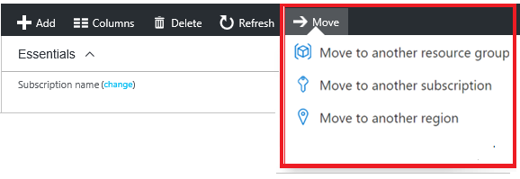

# Move Azure Resource

Um Ressourcen zu verschieben, wählen wir die Ressourcengruppe aus, die diese Ressourcen enthält, und klicken dann auf die Schaltfläche "Verschieben". Wir wählen die zu verschiebenden Ressourcen und die Zielressourcengruppe aus und Bestätigen, dass wir Skripts aktualisieren müssen.

Nur weil ein Dienst verschoben werden kann, bedeutet das nicht, dass es keine Einschränkungen gibt. Wir können beispielsweise ein virtuelles Netzwerk verschieben, müssen aber auch die davon abhängigen Ressourcen wie Gateways verschieben.

 
 

> [**⇤ Zurück zur Theorie**](https://gitlab.com/e-portfolio1/hf-cloud-native-engineer/semesterarbeiten/semesterarbeit-1/-/blob/main/Azure_Theorie/Azure_Ressource_Manager.md)