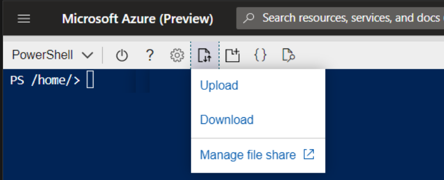

# Azure Cloud Shell

## Was ist die Azure Cloud Shell?

Die Azure Cloud Shell ist eine Browserbasierte CLI, zum Verwalten von Azure-Ressourcen,  welche unabhängig vom Betriebssystem agiert. Die Azure Cloud Shell ist flexiebel in hinsicht dder Shell-Umgebung, welche Bash oder PowerShell ist. Um über die Befehlszeile mit Azure-Ressourcen zu interagieren, müssen wir normalerweise die erforderlichen Komponenten auf unserem lokalen Computer (PC, Mac, Linux) installieren. Mit Cloud Shell verfügen wir über eine authentifizierte, interaktive Shell, die nicht Teil eines lokalen Computers ist.

Da Microsoft Cloud Shell verwaltet, haben wir von jedem Browser aus immer Zugriff auf die neuesten Versionen der Azure CLI- und PowerShell-Module. Wir müssen uns nicht darum kümmern, die Module auf dem neuesten Stand zu halten. Mit Cloud Shell öffnen wir einfach unseren Browser und melden uns an. Schon haben wir Zugriff auf eine Befehlszeilenumgebung, die vollständig mit den Berechtigungen unseres Kontos und den Ressourcen verbunden ist, auf die wir Zugriff haben. All dies funktioniert in einer Infrastruktur, die standardmäßig mit doppelter Verschlüsselung im Ruhezustand kompatibel ist. Wir müssen nichts weiter unternehmen!

Azure Cloud Shell bietet außerdem Cloud-Speicher zum Speichern von Dateien wie SSH-Schlüsseln, Skripts und mehr. Mit dieser Funktion können wir zwischen Sitzungen und mit verschiedenen Computern auf wichtige Dateien zugreifen. Schließlich können wir mit dem Cloud Shell-Editor direkt über die Cloud Shell-Oberfläche Änderungen an Dateien wie Skripts vornehmen, die in diesem Cloud-Speicher gespeichert sind.

## Zugriff auf die Cloud Shell

- [shell.azure.com](https://shell.azure.com/)
- Über das Azureportal
- Über Microsoft Learn

Wenn wir eine Cloud Shell-Sitzung eröffnen, wird im Hintergrund eine Azure VM erstellt, mit den neuesten Updates. 
In der Oberfläche können wir zusätzlich die Shell Sprache wählen (Bash oder PowerShell)

Cloud Shell-Sitzungen werden nach 20 Minuten Inaktivität beendet. Wenn eine Sitzung beendet wird, bleiben die Dateien auf unserem CloudDrive erhalten, aber wir müssen eine neue Sitzung starten, um auf die Cloud Shell-Umgebung zuzugreifen.

## Zugriff auf eigene Dateien und Scripts

Wenn wir möchten, können wir Dateien und Scripts in der Shell Speichern, diese werden dann in der CloudDrive gespeichert. 

Da unsere Datei nun auf CloudDrive liegt, können wir die Sitzung schließen und eine andere Sitzung auf einem anderen Gerät öffnen und trotzdem auf dieselbe Datei zugreifen. Mit Cloud Shell können wir auch eine Azure Storage-Dateifreigabe zuordnen, die an eine bestimmte Region gebunden ist. Durch den Zugriff auf eine Azure-Dateifreigabe können wir über Cloud Shell mit den Inhalten dieser Freigabe arbeiten.

Wenn wir Skripts bearbeiten müssen, die auf CloudDrive oder File Share gehostet sind, können wir den Cloud Shell-Editor verwenden. Wir wählen das Symbol mit den geschweiften Klammern {} im Browser aus und öffnen die Datei, die wir bearbeiten möchten, oder verwenden den Befehl code und geben den Dateinamen an.

## Cloud Shell-Tools

Wenn wir Ressourcen (wie Docker-Container oder Kubernetes-Cluster) verwalten müssen oder Nicht-Microsoft-Tools (wie Ansible und Terraform) in Cloud Shell verwenden möchten, sind diese Add-Ons in der Cloud Shell-Sitzung bereits vorkonfiguriert.

Hier ist eine Liste aller Add-Ons, die uns innerhalb einer Cloud Shell-Sitzung zur Verfügung stehen:
[Azure Cloud Shell Add-Ons](./Azure_Cloud_Add-Ons.md)

## Wann sollen wir Azure Cloud Shell Verwenden?

Wir können Azure Cloud Shell für Folgendes verwenden:

- Wir öffnen von jedem browserbasierten Gerät aus eine sichere Befehlszeilen-Sitzung. 
- Wir interagieren mit Azure-Ressourcen, ohne dass wir Plug-Ins oder Add-Ons auf unserem Gerät installieren müssen. 
- Wir behalten Dateien zwischen Sitzungen zur späteren Verwendung bei. 
- Wir verwenden zum Verwalten von Azure-Ressourcen je nach Wunsch Bash oder PowerShell. 
- Wir bearbeiten Dateien (z. B. Skripte) über den Cloud Shell-Editor. 

In folgenden Fällen sollten wir Azure Cloud Shell nicht verwenden:

- Wir möchten eine Sitzung für Skripts oder Aktivitäten mit langer Laufzeit länger als 20 Minuten geöffnet lassen. In diesen Fällen wird unsere Sitzung ohne Warnung getrennt und der aktuelle Status geht verloren.

- Wir benötigen Administratorberechtigungen, z. B. Sudo-Zugriff, aus der Azure CLI- oder PowerShell-Umgebung heraus. 

- Wir müssen Tools installieren, die in der eingeschränkten Cloud Shell-Umgebung nicht unterstützt werden, sondern eine Umgebung wie eine benutzerdefinierte virtuelle Maschine oder einen Container erfordern. 

- Wir benötigen Speicher aus verschiedenen Regionen. Möglicherweise müssen wir diesen Inhalt sichern und synchronisieren, da nur einer Region der Speicher zugewiesen werden kann, der Azure Cloud Shell zugewiesen ist. 

- Wir müssen mehrere Sitzungen gleichzeitig öffnen. Azure Cloud Shell lässt jeweils nur eine Instanz zu und ist nicht für die gleichzeitige Arbeit über mehrere Abonnements oder Mandanten hinweg geeignet.

 
 

> [**➯ Weiter zu "Azure Bash"**](./Azure_Bash.md)  
> [**⌂ Zurück zur Hauptseite**](https://gitlab.com/e-portfolio1/hf-cloud-native-engineer/semesterarbeiten/semesterarbeit-1)