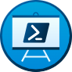

# Einführung in PowerShell



## Was ist PowerShell ?

PowerShell ist eine CLI und Skriptsprache zugleich. 
PowerShell wurde als Task-Engine entwickelt, welche Cmdlets verwendet, um Aufgaben zu verpacken, die Benutzer ausführen müssen. 
In PowerShell können Befehle auf lokalen oder Remotecomputern ausgeführt werden. 
Wir können unteranderem auch Aufgaben wie die Verwaltung von Benutzern und die Automatisierung von Workflows ausführen mit PowerShell.

*Vorteile einer CLI*

- Die Interaktion mit einer Konsole ist häufig schneller als die Verwendung einer grafischen Benutzeroberfläche.
  
- In einer Konsole können können Befehlsstapel ausgeführt werden, daher eignet sie sich ideal für die Aufgabenautomatisierung für kontinuierliche Integrationspipelines.
  
- Wir können eine Konsole verwenden, um mit Cloud-Ressourcen und anderen Ressourcen zu interagieren.
  
- Wir können Befehle und Skripte in einer Textdatei speichern und ein Quellcodeverwaltungssystem verwenden. Diese Funktion ist wahrscheinlich einer der größten Vorteile, da unsere Befehle wiederholbar und überprüfbar sind. In vielen Systemen, insbesondere in Regierungssystemen, muss alles verfolgt und ausgewertet oder überprüft werden . 
  Überprüfungen umfassen alles von Datenbankänderungen bis hin zu Änderungen, die durch ein Skript vorgenommen werden.

## Merkmale

PowerShell hat einige Funktionen mit herkömmlichen Shells gemeinsam:

- **Integriertes Hilfesystem** : Die meisten Shells verfügen über eine Art Hilfesystem, in dem Sie mehr über einen Befehl erfahren können. Sie können beispielsweise erfahren, was der Befehl bewirkt und welche Parameter er unterstützt. Das Hilfesystem in PowerShell bietet Informationen zu Befehlen und ist auch in Online-Hilfeartikel integriert.
  
- **Pipeline** : Herkömmliche Shells verwenden eine Pipeline, um viele Befehle nacheinander auszuführen. Die Ausgabe eines Befehls ist die Eingabe für den nächsten Befehl. PowerShell implementiert dieses Konzept wie herkömmliche Shells, unterscheidet sich jedoch dadurch, dass es Objekte über Text verarbeitet. Später in diesem Modul erfahren Sie mehr über diese Funktion.
  
- **Aliase** : Aliase sind alternative Namen, die zum Ausführen von Befehlen verwendet werden können. PowerShell unterstützt die Verwendung gängiger Aliase wie `cls`(Bildschirm löschen) und `ls`(Dateien auflisten). Daher können neue Benutzer ihr Wissen über andere Frameworks nutzen und müssen sich bei vertrauten Befehlen nicht unbedingt den PowerShell-Namen merken.

PowerShell unterscheidet sich in einigen Punkten von einer herkömmlichen Befehlszeilen-Shell:

- **Es arbeitet mit Objekten über Text.** 
  In einer Befehlszeilen-Shell müssen Sie Skripts ausführen, deren Ausgabe und Eingabe unterschiedlich sein können, sodass Sie letztendlich Zeit damit verbringen, die Ausgabe zu formatieren und die benötigten Daten zu extrahieren. Im Gegensatz dazu verwenden Sie in PowerShell Objekte als Eingabe und Ausgabe. Das bedeutet, dass Sie weniger Zeit mit dem Formatieren und Extrahieren verbringen.
  
- **Es verfügt über Cmdlets.** 
  Befehle in PowerShell werden Cmdlets genannt (ausgesprochen "commandlets"). In PowerShell werden Cmdlets auf einer gemeinsamen Laufzeitumgebung erstellt und nicht als separate ausführbare Dateien, wie dies in vielen anderen Shellumgebungen der Fall ist. Diese Eigenschaft sorgt für eine konsistente Erfahrung bei der Parameteranalyse und dem Pipelineverhalten. Cmdlets akzeptieren normalerweise Objekteingaben und geben Objekte zurück. Die Kern-Cmdlets in PowerShell werden in .NET Core erstellt und sind Open Source. Sie können PowerShell erweitern, indem Sie weitere Cmdlets, Skripts und Funktionen aus der Community und anderen Quellen verwenden, oder Sie können Ihre eigenen Cmdlets in .NET Core oder PowerShell erstellen.
  
- **Es gibt viele Arten von Befehlen.** 
  Befehle in PowerShell können native ausführbare Dateien, Cmdlets, Funktionen, Skripts oder Aliase sein. Jeder von Ihnen ausgeführte Befehl gehört zu einem dieser Typen. Die Wörter Befehl und Cmdlet werden häufig synonym verwendet, da ein Cmdlet ein Befehlstyp ist.

## Installation von PowerShell

PowerShell ist standardmässig ab Windows 8 bereits Vorinstalliert. 
Standardmässig ist PowerShell 5 (Windows PowerShell) vorinstalliert. 
Auf Mac und Linux muss dies jedoch nachträglich installiert werden. 


*Versionsüberprüfung von PowerShell*
```PowerShell
$PSVersionTable
```

```Output
Name                           Value
 ----                           -----
 PSVersion                      7.3.6
 PSEdition                      Core
 GitCommitId                    7.3.6
 OS                             Linux 5.4.0-1058-azure #60~18.04.1-Ubuntu SMP Tue Aug 31 20:34:4…
 Platform                       Unix
 PSCompatibleVersions           {1.0, 2.0, 3.0, 4.0…}
 PSRemotingProtocolVersion      2.3
 SerializationVersion           1.1.0.1
 WSManStackVersion              3.0
```

Im Output wird nun angezeigt, welche Installation wir installiert haben, sowie zur Plattform und der Edition.

Wenn wir jedoch nur die Version von PowerShell einsehen möchten, können wir eine abgeänderte Version vom Cmdlet nehmen:

```PowerShell
$PSVersionTable.PSVersion
```

Der Output sieht dem entsprechen so aus:

```Output
Major  Minor  Patch  PreReleaseLabel BuildLabel
-----  -----  -----  --------------- ----------
7      3      6
```

Was ist hier der unterschied, zum oberen Befehl. 
Das essentiell Wichtige ist der Punkt (.).
Beim Ausführen von `$PSVersionTable`wird eine Ausgabe ausgegeben, die wie eine Tabelle aussieht, aber eigentlich ein Objekt ist. Aus diesem Grund können wir einen Punkt ( .) verwenden, um auf eine bestimmte Eigenschaft zuzugreifen, z. B. `PSVersion`.


## Befehle suchen

Cmdlets sind kompilierte Befehle, die in .NET oder .NET Core entwickelt und als Befehle in PowerShell aufgerufen werden können. Es gibt Tausende von Cmdlets in unserer PowerShell-Installation, und die Herausforderung besteht darin, herauszufinden, was sie sind und was sie für uns tun können. Sie folgen einem Verb-Nomen-Namensstandard, der uns hilft, ihre Funktionen zu verstehen und nach ihnen zu suchen. Mit dem Cmdlet “Get-Verb” können wir eine Liste der zugelassenen Verben anzeigen, die nach Aktivitätstyp und Funktion geordnet sind.

```PowerShell
Get-Verb
```

```Output
Verb        AliasPrefix Group          Description
----        ----------- -----          -----------
Add         a           Common         Adds a resource to a container, or atta…
Clear       cl          Common         Removes all the resources from a contai…
```

Folgende drei zentrale Cmdlets lassen uns tiefer in die Existenz und Funktion eintauchen:

- **Get-Command**
  Listet alle auf dem System verfügbaren Cmdlets auf. 
  
- **Get-Help**
  Integriertes Hilfesystem aufrufen. 
  Als Alias kann man auch `help` verwenden
  
- **Get-Member**
  Wenn wir einen Befehl ausführen, erhalten wir ein Objekt mit vielen Eigenschaften. Mit dem Cmdlet `Get-Member` können wir diese Eigenschaften genauer untersuchen.

## Suche von Befehlen mit "Get-Command"

In PowerShell gibt es viele Cmdlets, keiner kann diese Auswendig, weshalb man dies mit Get-Command besser suchen kann. 
Wichtig zu beachten ist, dass wir den Aufbau eines Cmdlets kennen.
Anhand diesem Aufbau, können wir die Suche filtern, da wenn wir `Get-Command` aufrufen alle installierten Cmdlets abgerufen werden. 
In den nachfolgenden Beispielen, zeigen wir, wie eine solche Suche ablaufen kann:

```PowerShell
Get-Command -Noun alias*
```
*Mit dem `-Noun` Flag können wir nach dem Nomen-Teil suchen, welcher mit `alias` beginnt*.

```PowerShell
Get-Command -Verb Get -Noun alias*
```
*Nun suchen wir weiter, zusätzlich neben dem Nomen-Teil, suchen wir noch den Verb-Teil ab, welcher gleich `Get` lautet*.

<br>
<br>

> [➯ **Weiter zu "Azure Resource Manager-Templates"**](./Azure_Resource_Manager-Templates.md) <br>
> [⌂ **Zurück zur Azure Theorie**](../README.md)


