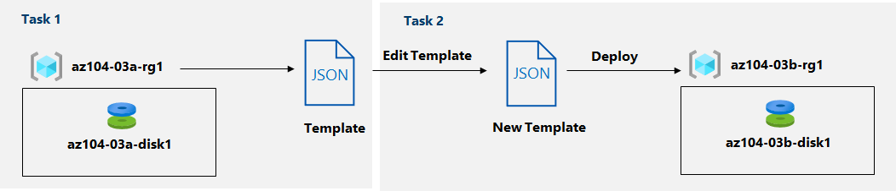

# Azure Resource Manager-Template Lab

## Szenario

Tailwind Traders migrieren ihren Speicherbedarf nach Azure. Sie haben erfolgreich einen verwalteten Datenträger in einer Ressourcengruppe bereitgestellt. Sie haben beschlossen, eine Azure Resource Manager-Vorlage zu erstellen, um die Bereitstellung anderer Datenträger zu vereinfachen.

## Architekturdiagramm

Ihre erste Datenträgerbereitstellung in der Ressourcengruppe az104- **03a** -rg1 ist abgeschlossen. Sie möchten die Vorlage anpassen und sie verwenden, um einen weiteren Datenträger in der Ressourcengruppe az104- **03b** -rg1 bereitzustellen.

## Aufgaben

- **Aufgabe 1** : Überprüfen Sie eine ARM-Vorlage für die Bereitstellung eines verwalteten Azure-Datenträgers.
- **Aufgabe 2** : Erstellen Sie mithilfe einer ARM-Vorlage einen verwalteten Azure-Datenträger.
- **Aufgabe 3** : Überprüfen Sie die auf ARM-Vorlagen basierende Bereitstellung des verwalteten Datenträgers.

 

### Aufgabe 1

Da es bereits eine Vorlage gab, aus der "vorherigen" Bereitstellung, wird dieses wiederverwendet. 
Um dieses Template zu sehen, öffnen wir im Azure Portal, die Ressourcengruppe, welche das Template bereits verwendet hat. 
Auf der Ressourcen Gruppe, gibt es dann den Reiter **Deployments** oder **Bereitstellung** unter **Settings/Einstellungen**. Dort drin sehen wir dann alle Bereitstellungen, inkl. dieser, welche wir verwenden möchten. Diejenige klicken wir an.  

Sobald es geöffnet ist, können wir es durchschauen und Downloaden. 
Nach dem Download können wir das Zip auch gleich im Explorer Entzipen.

### Aufgabe 2

Um das Template nun bereitzustellen, suchen wir über die Suchfunktion in Azure nach "*Deploy a custom Template*" und wählen diesen aus. 
Anschliessend geben wir unsere Informationen ein, wie Disk Name und Ressource Group. 
und erstellen unsere Bereitstellung. 
Nun können wir unter dem Reiter "Template" unser zuvor Heruntergeladenes Template-JSON hochladen und gewisse Anpassungen vornehmen. Vergleichsweise wie ein Cloud-Init-File behandeln, das was nicht gebraucht wird, entfernen.
Anschliessend das Parameter-JSON hochladen und wir haben das Template erstellt. 

### Aufgabe 3 

Sobald alles durchgelaufen ist, können wir in der neuen Ressource unser Template sehen und anschliessen überprüfen, ob alles in Ordnung ist. 

 
 

> [**⇤ Zurück zu Azure Resource Manager-Template**](./Azure_Resource_Manager-Templates.md)