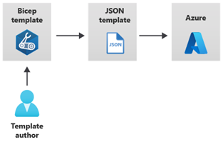
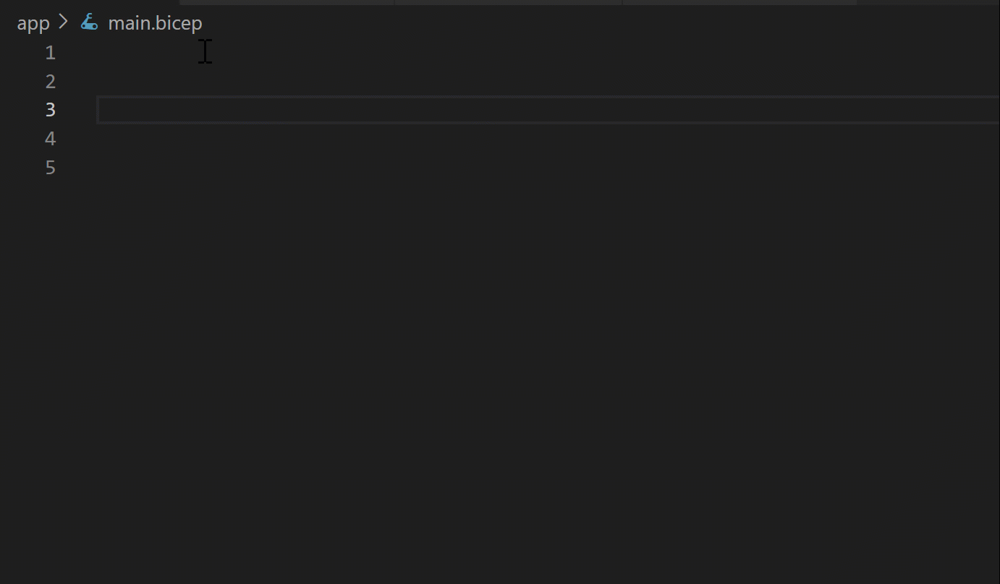
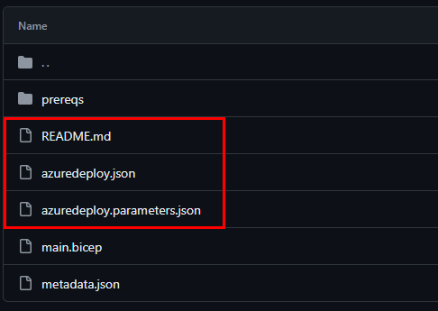

# Azure Resource Manager-Templates


Ein Azure Resource Manager-Template definiert alle Resource Manager-Ressourcen in einer Bereitstellung genau. Wir können eine Resource Manager-Template in einem einzigen Vorgang in einer Ressourcengruppe bereitstellen.

Durch die Verwendung von Resource Manager-Templates werden unsere Bereitstellungen schneller und wiederholbarer. Wir müssen beispielsweise nicht mehr eine VM im Portal erstellen, warten, bis sie abgeschlossen ist, und dann die nächste VM erstellen. Das Resource Manager-Template übernimmt die gesamte Bereitstellung für uns.


## Vorteile eines Templates

- **Templates verbessern die Konsistenz**
  Resource Manager-Templates dienen als einheitliche Sprache zur Beschreibung von Bereitstellungen. Sie gewährleisten Konsistenz in Struktur, Format und Ausdrücken, unabhängig vom verwendeten Tool oder SDK für die Bereitstellung.
  
- **Templates helfen beim Darstellen komplexer Bereitstellungen**
  Mit Vorlagen können wir mehrere Ressourcen in der richtigen Reihenfolge bereitstellen. Beispielsweise würden wir keine virtuelle Maschine bereitstellen wollen, bevor wir eine Betriebssystemdisk oder Netzwerkschnittstelle erstellt haben. Der Resource Manager kartiert jede Ressource und ihre abhängigen Ressourcen und erstellt zuerst die abhängigen Ressourcen. Die Abhängigkeitszuordnung stellt sicher, dass wir die Bereitstellung in der richtigen Reihenfolge durchführen
  
- **Templates reduzieren manuelle, fehleranfällige Aufgaben**
  Das manuelle Erstellen und Verbinden von Ressourcen kann zeitaufwändig sein und es können leicht Fehler passieren. Resource Manager stellt sicher, dass die Bereitstellung jedes Mal auf die gleiche Weise erfolgt.
  
- **Templates sind Code**
  Templates drücken unsere Anforderungen durch Code aus. Wir können uns ein Template als eine Art “Infrastruktur als Code” vorstellen, die wie jede andere Software freigegeben, getestet und versioniert werden kann. Da Templates Code sind, können wir eine “Papierspur” erstellen, der wir folgen können. Der Templatecode dokumentiert die Bereitstellung. Die meisten von uns pflegen ihre Vorlagen unter einer Art Revisionskontrolle, wie zum Beispiel GIT. Wenn wir die Vorlage ändern, dokumentiert ihr Revisionsverlauf auch, wie sich die Vorlage (und unsere Bereitstellung) im Laufe der Zeit entwickelt hat.
  
- **Templates fördern die Wiederverwendung**
  Unser Template kann Parameter enthalten, welche beim Ausführen des Templszr ausgefüllt werden. Ein Parameter kann einen Benutzernamen oder ein Passwort, einen Domänennamen usw. definieren. Templateparameter ermöglichen uns die Erstellung mehrerer Versionen unserer Infrastruktur, z. B. Staging und Produktion, während wir immer noch genau dasselbe Template verwenden.
  
- **Templates sind verknüpfbar**
  Wir können Resource Manager-Templates miteinander verknüpfen, um die Templates selbst modular zu gestalten. Wir können kleine Templates schreiben, die jeweils einen Teil einer Lösung definieren, und diese dann kombinieren, um ein vollständiges System zu erstellen.
 
- **Templates vereinfachen die Orchestrierung**
  Wir müssen nur das Template bereitstellen, um all unsere Ressourcen bereitzustellen. Normalerweise würde dies mehrere Vorgänge erfordern.


## Azure Resource Manager-Templateschema

Templates in Azure Resource Manager werden in JSON geschrieben, sodass Sie als Objekt gespeicherte Daten (z. B. VM) in Text ausdrücken können. Ein JSON-Dokument ist im Wesentlichen eine Sammlung von Schlüssel-Wert-Paaren. Jeder Schlüssel ist eine Zeichenfolge, deren Wert sein kann:

- Ein String (Zeichenkette)
- Eine Zahl
- Ein Boolischer Ausdruck
- Eine Liste von Werten
- Ein Objekt (das eine Sammlung anderer Schlüssel-Wert-Paare ist)

Eine Resource Manager-Vorlage kann Abschnitte enthalten, die in JSON-Notation ausgedrückt werden, aber nicht mit der JSON-Sprache selbst in Zusammenhang stehen:

```JSON
{
    "$schema": "http://schema.management.azure.com/schemas/2019-04-01/deploymentTemplate.json#",
    "contentVersion": "",
    "parameters": {},
    "variables": {},
    "functions": [],
    "resources": [],
    "outputs": {}
}
```

| **Elementname** | **Erforderlich** | **Beschreibung** |
| --------------- | ---------------- | ---------------- |
| $schema | Ja | Speicherort der JSON-Schemadatei, die die Version der Vorlagensprache beschreibt. Verwenden Sie die im vorherigen Beispiel gezeigte URL. |
| Inhaltsversion | Ja | Version der Vorlage (z. B. 1.0.0.0). Sie können für dieses Element einen beliebigen Wert angeben. Verwenden Sie diesen Wert, um wichtige Änderungen in Ihrer Vorlage zu dokumentieren. Mit diesem Wert können Sie sicherstellen, dass die richtige Vorlage verwendet wird. |
| Parameter | NEIN | Werte, die bei der Ausführung der Bereitstellung bereitgestellt werden, um die Ressourcenbereitstellung anzupassen. |
| Variablen | NEIN | Werte, die als JSON-Fragmente in der Vorlage verwendet werden, um Ausdrücke in der Vorlagensprache zu vereinfachen. |
| Funktionen | NEIN | Benutzerdefinierte Funktionen, die innerhalb der Vorlage verfügbar sind. |
| Ressourcen | Ja | Ressourcentypen, die in einer Ressourcengruppe bereitgestellt oder aktualisiert werden. |
| Ausgänge | NEIN | Werte, die nach der Bereitstellung zurückgegeben werden. |

## Azure Resource Manager-Templateparameter

Im Parameterbereich der Vorlage geben wir an, welche Werte wir beim Bereitstellen der Ressourcen eingeben können. Die verfügbaren Eigenschaften für einen Parameter sind:

```JSON
"parameters": {
    "<parameter-name>" : {
        "type" : "<type-of-parameter-value>",
        "defaultValue": "<default-value-of-parameter>",
        "allowedValues": [ "<array-of-allowed-values>" ],
        "minValue": <minimum-value-for-int>,
        "maxValue": <maximum-value-for-int>,
        "minLength": <minimum-length-for-string-or-array>,
        "maxLength": <maximum-length-for-string-or-array-parameters>,
        "metadata": {
        "description": "<description-of-the parameter>"
        }
    }
}
```

Dies ist ein Beispiel, das zwei Parameter veranschaulicht: einen für den Benutzernamen einer virtuellen Maschine und einen für ihr Passwort:

```JSON
"parameters": {
  "adminUsername": {
    "type": "string",
    "metadata": {
      "description": "Username for the Virtual Machine."
    }
  },
  "adminPassword": {
    "type": "securestring",
    "metadata": {
      "description": "Password for the Virtual Machine."
    }
  }
}
```

Wichtig zu beachten ist, dass maximal 256 Parameter in einem Template verwendet werden dürfen. 


## Bicep-Template

Azure Bicep ist eine domänenspezifische Sprache (DSL), die deklarative Syntax zum Bereitstellen von Azure-Ressourcen verwendet. Sie bietet präzise Syntax, zuverlässige Typsicherheit und Unterstützung für die Wiederverwendung von Code.

Sie können Bicep anstelle von JSON verwenden, um Ihre Azure Resource Manager-Vorlagen (ARM-Vorlagen) zu entwickeln. Die JSON-Syntax zum Erstellen einer ARM-Vorlage kann ausführlich sein und komplizierte Ausdrücke erfordern. Die Bicep-Syntax reduziert diese Komplexität und verbessert die Entwicklungserfahrung. Bicep ist eine transparente Abstraktion über ARM-Vorlagen-JSON und verliert keine der JSON-Vorlagenfunktionen.


### Das Prinzip von Bicep

Wenn eine Ressource oder eine Reihe von Ressourcen in Azure bereitgestellt werden, konvertieren die in Bicep integrierten Tools das Bicep-Template in ein JSON-Template. Dieser Vorgang wird als Transpilierung bezeichnet. Transpilierung ist der Vorgang, bei dem Quellcode, der in einer Sprache geschrieben wurde, in eine andere Sprache konvertiert wird.
Dies veranschaulicht auch die nachfolgende Grafik:



Im Vergleich zu JSON bietet Bicep viele Verbesserungen für die Templateerstellung, darunter: 
- **Einfachere Syntax**
  Bicep bietet uns eine vereinfachte Syntax zum Erstellen von Vorlagen. Wir können Parameter und Variablen direkt referenzieren, ohne auf komplexe Funktionen zurückgreifen zu müssen. Anstatt Verkettungen zu verwenden, nutzen wir Zeichenketteninterpolation, um Werte für Namen und andere Elemente zu kombinieren. Wir können die Eigenschaften einer Ressource direkt referenzieren, indem wir ihren symbolischen Namen anstelle komplexer Referenzanweisungen verwenden. Diese Verbesserungen der Syntax erleichtern uns sowohl das Erstellen als auch das Lesen von Bicep-Vorlagen.
  
  Bsp-Syntax:
```Bicep
param location string = resourceGroup().location
param storageAccountName string = 'toylaunch${uniqueString(resourceGroup().id)}'

resource storageAccount 'Microsoft.Storage/storageAccounts@2021-06-01' = {
  name: storageAccountName
  location: location
  sku: {
    name: 'Standard_LRS'
  }
  kind: 'StorageV2'
  properties: {
    accessTier: 'Hot'
  }
}
```
  
- **Module**
  Wir können komplexe Vorlagenbereitstellungen in kleinere Moduldateien aufteilen und in einer Hauptvorlage darauf verweisen. Diese Module ermöglichen uns eine einfachere Verwaltung und bessere Wiederverwendbarkeit.
  
- **Automatisches Abhängigkeitsmanagement**
  In den meisten Fällen erkennt Bicep automatisch Abhängigkeiten zwischen unseren Ressourcen. Dieser Prozess nimmt uns einen Teil der Arbeit ab, die mit der Erstellung von Vorlagen verbunden ist.
  
- **Type-Validierung und IntelliSense** 
  Die Bicep-Erweiterung für Visual Studio Code bietet umfassende Validierung und IntelliSense für alle API-Definitionen von Azure-Ressourcentypen. Diese Funktion erleichtert die Erstellung.


*Quelle: Microsoft Doku Azure Bicep*

  

## QuickStart-Templates

[Azure Quickstart-Templates](https://azure.microsoft.com/resources/templates/) sind bereitgestellte Azure Resource Manager-Templates, welche durch die Azure Community erstellt wurden. 

Einige Templates bieten alles, was wir zum Bereitstellen unserer Lösung benötigen, während andere als Ausgangspunkt für unsere Vorlage dienen können. In jedem Fall können wir diese Vorlagen studieren, um zu lernen, wie wir unsere eigenen Vorlagen am besten erstellen und strukturieren.
Die Quickstart-Templates werden unteranderem in Github abgespeichert, wo wir min. drei Dateitypen vorfinden werden:



- Die Datei README.md bietet einen Überblick über die Funktion der Vorlage.
- Die Datei azuredeploy.json definiert die Ressourcen, die bereitgestellt werden.
- Die Datei azuredeploy.parameters.json stellt die Werte bereit, die die Vorlage benötigt.
 

## Lab Simulation

[Lab Simulation zu ARM-Templates](./Azure_Resource_Manager-Template_Lab.md)

<br>
<br>

> [**⇤ Zurück zu "Azure Theorie"**](./README.md) <br>
> [⌂ **Zurück zur Hauptseite**](https://gitlab.com/e-portfolio1/hf-cloud-native-engineer/semesterarbeiten/semesterarbeit-1)