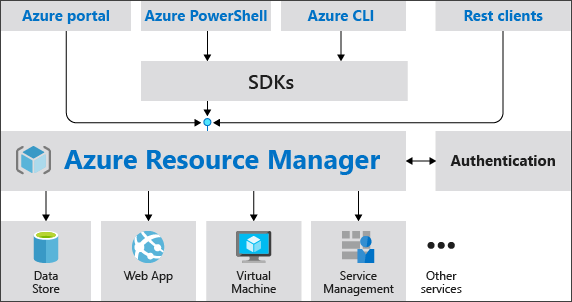
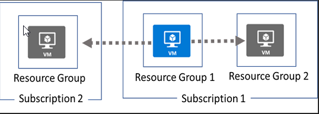

# Azure Ressource Manager

Die Infrastruktur für Ihre Anwendung besteht normalerweise aus vielen Komponenten – beispielsweise einer virtuellen Maschine, einem Speicherkonto und einem virtuellen Netzwerk oder einer Webanwendung, einer Datenbank, einem Datenbankserver und Diensten von Drittanbietern.

Diese Komponenten sind miteinander Verbundene und voneinander abhängige Teile einer einzelnen Entity.

Wir möchten diese bereitstellen (deploy), managen und überwachen (monitor) als eine Gruppe

Mit dem Azure Resource Manager können wir mit den Ressourcen in unserer Lösung (solution) als Gruppe arbeiten. Wir können alle Ressourcen für unsere Lösung in einem einzigen, koordinierten Vorgang bereitstellen, aktualisieren oder löschen.
Wir können eine Vorlage verwenden für die Bereitstellung und diese Vorlage kann für verschiedene Umgebungen wie Test, Staging und Produktion verwendet werden. Azure Resource Manager bietet Sicherheits-, Audit- und Tagging-Funktionen, die uns bei der Verwaltung unserer Ressourcen nach der Bereitstellung unterstützen.

## Consistent management layer

Azure Resource Manager provides a consistent management layer to perform tasks through Azure PowerShell, Azure CLI, Azure portal, REST API, and client SDKs. Choose the tools and APIs that work best for you.

Die folgende Abbildung zeigt, wie alle Tools mit der gleichen Azure Resource Manager-API interagieren. Die API leitet Anfragen an den Azure Resource Manager-Dienst weiter, der die Anfragen authentifiziert und autorisiert. Azure Resource Manager leitet dann die Anfragen an die entsprechenden Ressourcenanbieter weiter.

Im Bild wird das Ganze graphisch dargestellt:

## Vorteile

Der Azure Resource Manager hat einige Vorteile: 

- Wir können alle Ressourcen für unsere Lösung als Gruppe bereitstellen, verwalten und überwachen, anstatt diese Ressourcen einzeln zu verwalten.

- Wir können unsere Lösung während des gesamten Entwicklungszyklus wiederholt einsetzen und uns darauf verlassen, dass unsere Ressourcen in einem konsistenten Zustand bereitgestellt werden.

- Wir können unsere Infrastruktur über deklarative Vorlagen statt über Skripte verwalten.

- Wir können die Abhängigkeiten zwischen Ressourcen definieren, damit sie in der richtigen Reihenfolge bereitgestellt werden.

- Wir können die Zugriffskontrolle auf alle Dienste in unserer Ressourcengruppe anwenden, da die rollenbasierte Zugriffskontrolle (Role-Based Access Control, RBAC) nativ in die Verwaltungsplattform integriert ist.

- Wir können den Ressourcen Tags zuweisen, um alle Ressourcen in unserem Abonnement logisch zu organisieren.

- Wir können die Abrechnung unserer Organisation verdeutlichen, indem wir die Kosten für eine Gruppe von Ressourcen mit demselben Tag anzeigen.

## Leitfaden

Die folgenden Vorschläge helfen uns, die Vorteile von Azure Resource Manager bei der Arbeit mit unseren Lösungen voll auszuschöpfen.

- Definieren und implementieren Sie Ihre Infrastruktur über die deklarative Syntax in Azure Resource Manager-Vorlagen und nicht über imperative Befehle.

- Definieren Sie alle Bereitstellungs- und Konfigurationsschritte in der Vorlage. Sie sollten keine manuellen Schritte zum Einrichten Ihrer Lösung benötigen.

- Führen Sie imperative Befehle aus, um Ihre Ressourcen zu verwalten, beispielsweise um eine App oder Maschine zu starten oder zu stoppen.

- Ordnen Sie Ressourcen mit demselben Lebenszyklus in einer Ressourcengruppe an. Verwenden Sie Tags für die restliche Organisation von Ressourcen.

## Azure Resource Terminologie

- Resource (Ressource)
    Ein verwaltbares Element im Azure. Einige gängige Ressourcen sind eine virtuelle Maschine, ein Speicherkonto, eine Web-App, eine Datenbank und ein virtuelles Netzwerk. 

- Ressource Group (Ressourcengruppe)
    In Azure verwenden wir eine Ressourcengruppe als Container, der zugehörige Ressourcen für unsere Azure-Lösung enthält. Diese Ressourcengruppe kann entweder alle Ressourcen für die Lösung enthalten oder nur diejenigen, die wir als Gruppe verwalten möchten. Wie wir Ressourcen Ressourcengruppen zuweisen, hängt davon ab, was für unsere Organisation am sinnvollsten ist. Es bietet uns also Flexibilität und Kontrolle bei der Verwaltung unserer Azure-Ressourcen.

- Resource Provider (Ressourcenanbieter)
    Wir nutzen einen Dienst, der uns die Ressourcen zur Verfügung stellt, die wir über den Resource Manager bereitstellen und verwalten können. Jeder von uns genutzte Ressourcenanbieter bietet Vorgänge an, mit denen wir mit den bereitgestellten Ressourcen arbeiten können. Einige der gängigen Ressourcenanbieter, die wir nutzen, sind Microsoft.Compute, der uns die Ressource für virtuelle Maschinen bereitstellt, Microsoft.Storage, der uns die Ressource für Speicherkonten bereitstellt, und Microsoft.Web, der uns Ressourcen für Web-Apps bereitstellt.

- Template (Vorlage) 
    Wir arbeiten mit einer JSON-Datei (JavaScript Object Notation), die eine oder mehrere Ressourcen definiert, die wir in einer Ressourcengruppe bereitstellen möchten. Sie definiert auch die Abhängigkeiten zwischen den Ressourcen, die wir bereitstellen. Wir können die Vorlage verwenden, um die Ressourcen konsistent und wiederholt bereitzustellen.

- Declarative Syntax (Deklarative Syntax)
    Syntax ohne die Programmierbefehlsfolge zum Erstellen schreiben zu müssen.
    Die Resource Manager-Vorlage ist ein Beispiel für deklarative Syntax. In der Datei definieren Sie die Eigenschaften für die Infrastruktur, die in Azure bereitgestellt werden soll.

## Ressourcenanbieter

Jeder Ressourcenanbieter bietet eine Reihe von Ressourcen und Vorgängen für die Arbeit mit einem Azure-Dienst. 
Der Name eines Ressourcentyps hat das Format: {resource-provider}/{resource-type} . Der Schlüsseltresortyp ist beispielsweise Microsoft.KeyVault/vaults .
    
Unter folgenden Link werden alle Ressourcenanbieter aufgelistet. 
    
[Liste der Ressourcenanbieter: Finden Sie Ressourcenanbieter nach Azure-Diensten - Azure Resource Manager | Microsoft Learn](https://learn.microsoft.com/de-de/azure/azure-resource-manager/management/azure-services-resource-providers)
    
    
## Erstellen einer Ressourcengruppe

Wir können Ressourcen in jeder neuen oder bestehenden Ressourcengruppe bereitstellen. Diese Bereitstellung wird zu einem Job, den wir verfolgen können. Bei Fehlschlägen liefert der Job Ausgaben, die uns helfen, den Fehler zu verstehen und zu beheben. Unabhängig von der Art der bereitgestellten Ressource, nutzen wir diese Informationen zur Fehlerbehebung und Wiederholung der Bereitstellung. Unsere Bereitstellungen sind inkrementell, das heißt, wenn wir eine weitere Web-App zu einer Gruppe hinzufügen, bleiben die bestehenden unberührt.

## Überlegungen

Ressourcengruppen sind im einfachsten Fall eine logische Sammlung von Ressourcen.
Folgende Regeln gibt es dazu: 

- Ressourcen können nur in einer Ressourcengruppe vorhanden sein.

- Ressourcengruppen können nicht umbenannt werden.

- Ressourcengruppen können Ressourcen vieler verschiedener Typen (Dienste) enthalten.

- Ressourcengruppen können Ressourcen aus vielen verschiedenen Regionen haben.

## Das Erstellen von Ressourcengruppen

Auf folgendes muss geachtet werden, beim Erstellen von Ressourcengruppen:

- Wir verwalten alle Ressourcen in unserer Gruppe gemeinsam, da sie denselben Lebenszyklus haben. Wenn eine Ressource, z. B. ein Datenbankserver, in einem anderen Bereitstellungszyklus vorhanden sein muss, sollte sie sich in einer anderen Ressourcengruppe befinden.

- Jede Ressource kann nur in einer Ressourcengruppe vorhanden sein.

- Wir können jeder Zeit eine Ressource einer Ressourcengruppe hinzufügen oder entfernen. 

- Das Verschieben einer Ressource von Ressourcengruppe zu Ressourcengruppe ist möglich, man muss jedoch aufpassen, da dabei [Einschränkungen](https://learn.microsoft.com/en-us/azure/azure-resource-manager/management/move-support-resources) bestehen. 

- In einer Ressourcengruppe können Ressourcen aus diversen Regionen sein. 

- Die Ressourcengruppe hilft uns dabei, die Zugriffskontrolle für Verwaltungsaktionen einzuschränken. Beispielsweisse können wir so die Berechtigung zentral verwalten, in dem wir auf der Ressourcengruppe die Berechtigung setzen. So können wir Ressourcen einfach hinzufügen / entfernen / ändern und Sie haben die zugewiesenen Rechte. 

- Eine Ressource kann mit Ressourcen in anderen Ressourcengruppen interagieren. Diese Interaktion ist üblich, wenn die beiden Ressourcen zwar verknüpft sind, aber nicht denselben Lebenszyklus haben (z. B. Web-Apps, die eine Verbindung zu einer Datenbank herstellen).

Wenn wir eine Ressourcengruppe erstellen, müssen wir einen Speicherort dafür festlegen. Dieser Speicherort ist wichtig, weil die Ressourcengruppe dort ihre Metadaten speichert. Für Compliance-Zwecke kann es notwendig sein, sicherzustellen, dass unsere Daten in einer bestimmten Region gespeichert werden.

## Azure Ressource Mangersperren erstellen

Ein tollpatschiger Admin kann relativ schnell etwas löschen. 
Dabei können Monate lange Arbeiten zunichte gemacht werden. 
Um dem Vorzubeugen, können wir eine Ressource Managersperre erstellen, damit dies nicht so leicht geschieht.  

Die Sperre kann einer Subscription (Abonnement), einer Ressourcengruppe oder einer Ressource zugewiesen werden. 
Solche Sperren werden an untergeordneten Ressourcen vererbt. 

Lock Types

Es gibt zwei Arten von Sperren

- Read-Only Sperre
- Löschsperre

Solche Sperren können nur die Owner und User Access Administratoren erstellen und löschen. 

## Reorganisieren von Azure-Ressourcen

Es kann sein, dass Ressourcen in eine neue Subscription oder einer neuen Ressourcengruppe in der selben Subscrition wechseln müssen. Beispielsweise bei einem Change der Subscription wegen einer Aktion oder Vertrages.

Veranschaulichen soll uns das dieses Bild: 

  
*Wechsel von Subscription*

Beim Verschieben von Ressourcen werden sowohl die Quellgruppe als auch die Zielgruppe während des Vorgangs gesperrt. Schreib- und Löschvorgänge werden für die Ressourcengruppen blockiert, bis die Verschiebung abgeschlossen ist. Diese Sperre bedeutet, dass wir in den Ressourcengruppen keine Ressourcen hinzufügen, aktualisieren oder löschen können.

**Wichtig**: Die Ressource bleibt weiterhin verfügbar für Anwendungen, welche auf sie zugreifen. 

## Einschränkungen

Unter folgendem Link wird detailliert beschrieben, welche Ressourcen zwischen Ressourcengruppen, Abonnements und Regionen verschoben werden können.

https://learn.microsoft.com/en-us/azure/azure-resource-manager/management/move-support-resources

## Implementation

Für die Implementation gibt es einige Anleitungen, welche über die Links unten eingesehen werden können: 

- [Move Azure Resource](./ARM_Anwendungsanleitungen/MoveAzureRessource.md)
- [Remove Resource / Resource Group](./ARM_Anwendungsanleitungen/RemoveResourcesResourceGroups.md)
- [Limits of Resource](./ARM_Anwendungsanleitungen/Resourcelimits.md)

## Summary Azure Ressource Manager

Azure Ressource Manager ist unser Bereitstellungs- und Verwaltungsdienst für Azure. Er bietet uns eine Verwaltungsebene, mit der wir Ressourcen in unserem Azure-Konto erstellen, aktualisieren und löschen können. Wir verwenden Verwaltungsfunktionen wie Zugriffskontrolle, Sperren und Tags, um unsere Ressourcen nach der Bereitstellung zu sichern und zu organisieren.

 
 

> [➯ **Weiter zu "Azure Cloud Shell"**](./Azure_Cloud_Shell.md)  
> [⌂ **Zurück zur Azure Theorie**](../README.md)
