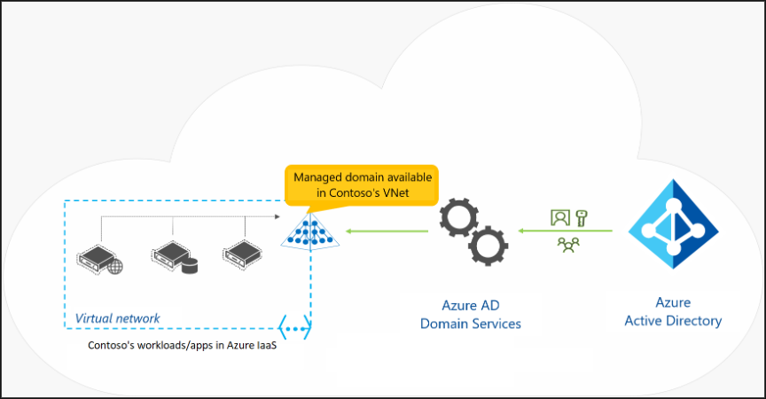

# Entra ID

Microsoft Entra ID ist Teil des PaaS-Angebots und wird als von Microsoft verwalteter Verzeichnisdienst in der Cloud betrieben. 
Es ist weder Teil der Kerninfrastruktur, die Kunden besitzen und verwalten, noch handelt es sich um ein IaaS-Angebot. Dies bedeutet zwar, dass wir weniger Kontrolle über die Implementierung haben, bedeutet aber auch, dass wir keine Ressourcen für die Bereitstellung oder Wartung bereitstellen müssen.

Mit Microsoft Entra ID haben wir ausserdem Zugriff auf eine Reihe von Funktionen, die in AD DS nicht nativ verfügbar sind, z. B. Unterstützung für mehrstufige Authentifizierung, Identitätsschutz und Self-Service-Kennwortzurücksetzung.

Mit der Microsoft Entra ID können wirOrganisationen und Einzelpersonen einen sichereren Zugriff auf Cloud-basierte Ressourcen ermöglichen, indem wir:

- Konfigurieren des Zugriffs auf Anwendungen
- Konfigurieren von SSO für Cloud-basierte SaaS-Anwendungen
- Bereitstellen und Verwalten von Benutzern und Gruppen
- Föderation zwischen Organisationen ermöglichen
- Bereitstellung einer Identitätsmanagementlösung
- Identifizieren unregelmäßiger Anmeldeaktivitäten
- Konfigurieren der Multi-Faktor-Authentifizierung
- Erweiterung vorhandener lokaler Active Directory-Implementierungen auf Microsoft Entra ID
- Konfigurieren des Anwendungsproxys für Cloud- und lokale Anwendungen
- Konfigurieren des bedingten Zugriffs für Benutzer und Geräte

Microsoft Entra ist ein separater Azure-Dienst, der automatisch in jedes neue Azure-Abonnement aufgenommen wird. Die Basisversion, die als Free-Stufe bezeichnet wird, verursacht keine zusätzlichen Kosten. Sobald wir Microsoft Online-Geschäftsdienste wie Microsoft 365 oder Microsoft Intune abonnieren, erhalten wir automatisch eine Microsoft Entra-ID mit Zugriff auf alle kostenlosen Funktionen.

In der Free-Stufe sind folgende Funktionen enthalten:
- Verzeichnisverwaltung
- SSO
- Self-Service-Kenwortzurücksetzung
- MFA
- Identitätsschutz

Einige der erweiterten Identitätsverwaltungsfunktionen erfordern kostenpflichtige Versionen von Microsoft Entra ID, die in den Stufen „Basic“ und „Premium“ angeboten werden. Einige dieser Funktionen sind auch automatisch in Microsoft Entra-Instanzen enthalten, die im Rahmen von Microsoft 365-Abonnements generiert werden.

Die Implementierung von Microsoft Entra ID ist nicht dasselbe wie die Bereitstellung virtueller Maschinen in Azure, das Hinzufügen von AD DS und die anschließende Bereitstellung einiger Domänencontroller für eine neue Gesamtstruktur und Domäne. Microsoft Entra ID ist ein anderer Dienst, der sich viel stärker auf die Bereitstellung von Identitätsverwaltungsdiensten für webbasierte Apps konzentriert, im Gegensatz zu AD DS, das sich mehr auf lokale Apps konzentriert.

## Microsoft Entra-Tenants

Im Gegensatz zu AD DS ist Microsoft Entra ID mehrinstanzenfähig und speziell darauf ausgelegt, die Isolierung zwischen einzelnen Verzeichnisinstanzen zu gewährleisten. Es ist das weltweit grösste mehrinstanzenfähige Verzeichnis, das über eine Million Verzeichnisdienstinstanzen hostet und Milliarden von Authentifizierungsanforderungen pro Woche verarbeitet.

Der Begriff „Tenant“ bezieht sich normalerweise auf ein Unternehmen oder eine Organisation, die ein Subscription für einen cloudbasierten Microsoft-Dienst wie Microsoft 365, Intune oder Azure abgeschlossen hat. Technisch gesehen steht der Begriff „Tenant“ jedoch für eine einzelne Microsoft Entra-Instanz. Innerhalb eines Azure-Abonnements können Sie mehrere Microsoft Entra-Tenants erstellen, was nützlich sein kann, wenn Sie die Microsoft Entra-Funktionalität in einem Mandanten testen möchten, ohne die anderen zu beeinträchtigen.

Eine Azure-Subscription muss zu jedem Zeitpunkt mit genau einem Microsoft Entra-Mandanten verknüpft sein. Mit dieser Verknüpfung können Sie Benutzern, Gruppen und Anwendungen, die in diesem bestimmten Microsoft Entra-Mandanten vorhanden sind, Berechtigungen für Ressourcen im Azure-Abonnement (über RBAC) erteilen.

Jeder Microsoft Entra-Mandant erhält einen standardmässigen Domain Name System (DNS)-Domänennamen, der aus einem eindeutigen Präfix besteht. Dieses Präfix wird vom Namen des Microsoft-Kontos abgeleitet, das Sie zum Erstellen eines Azure-Abonnements verwenden, oder es wird explizit beim Erstellen eines Microsoft Entra-Tenant angegeben. Auf dieses Präfix folgt das Suffix onmicrosoft.com.

Es ist möglich und üblich, mindestens einen benutzerdefinierten Domänennamen zum gleichen Microsoft Entra-Mandanten hinzuzufügen. Dieser Name verwendet den DNS-Domänennamespace, den das entsprechende Unternehmen oder die entsprechende Organisation besitzt.

Der Microsoft Entra-Tenant dient als Sicherheitsgrenze und Container für Microsoft Entra-Objekte wie Benutzer, Gruppen und Anwendungen. Ein einzelner Microsoft Entra-Mandant kann mehrere Azure-Subscriptions unterstützen.

## Microsoft Entra-Schema

Das Microsoft Entra ID-Schema enthält weniger Objekttypen als das von AD DS. Es enthält keine Definition der Computerklasse, obwohl es die Geräteklasse enthält. Der Prozess zum Verbinden von Geräten mit Microsoft Entra ID unterscheidet sich erheblich vom Prozess zum Verbinden von Computern mit AD DS. Das Schema ist leicht erweiterbar und seine Erweiterungen sind vollständig reversibel.

Microsoft Entra ID unterstützt keine traditionelle Domänenmitgliedschaft von Computern, daher können wir es nicht verwenden, um Computer oder Benutzereinstellungen mit herkömmlichen Verwaltungstechniken wie Gruppenrichtlinienobjekten (GPOs) zu verwalten. Stattdessen bietet Microsoft Entra ID ein Konzept der modernen Verwaltung. Seine Hauptstärken liegen in der Bereitstellung von Verzeichnisdiensten, der Speicherung und Veröffentlichung von Benutzer-, Geräte- und Anwendungsdaten sowie der Authentifizierung und Autorisierung von Benutzern, Geräten und Anwendungen.

Microsoft Entra ID unterstützt keine Organisationseinheiten (OU), trotzdem können wir eine ähnliche Struktur erreichen, indem wir Objekte nach ihrer Gruppenmitgliedschaft organisieren.

In Microsoft Entra ID repräsentieren die Klassen Application und servicePrincipal Anwendungen. Ein Application-Objekt beinhaltet die Definition einer Anwendung, während ein servicePrincipal-Objekt deren Instanz in einem bestimmten Microsoft Entra ID-Tenant darstellt. Diese Trennung ermöglicht es, eine Anwendung in einem Tenant zu definieren und sie in mehreren Tenants zu nutzen, indem für jede Anwendung ein servicePrincipal-Objekt in jedem Tenant erstellt wird. Dieses servicePrincipal-Objekt wird von Microsoft Entra ID erstellt, wenn die entsprechende Anwendung im Tenant registriert wird.

Der massgebliche Unterschied zwischen Application und servicePrincipal in Microsoft Entra ID besteht darin, dass das Application-Objekt von einem Administrator oder Entwickler erstellt wird, um eine Anwendung zu definieren. Das servicePrincipal-Objekt wird dann automatisch von Microsoft Entra ID erstellt, wenn die Anwendung in einem bestimmten Tenant registriert wird. Jedes servicePrincipal-Objekt repräsentiert eine Instanz der Anwendung im jeweiligen Tenant und enthält tenant-spezifische Details und Berechtigungen. Es ermöglicht der Anwendung, Ressourcen innerhalb dieses Tenants zu nutzen und auf sie zuzugreifen. Es ist nicht so, dass der servicePrincipal durch die Anwendung selbst erstellt wird. Es wird vielmehr durch die Registrierung der Anwendung im Tenant durch den Administrator oder Entwickler erstellt.

Ein Azure-Subscription muss zu jedem Zeitpunkt mit genau einem Microsoft Entra ID-Tenant verknüpft sein. Mit dieser Verknüpfung können wir Benutzern, Gruppen und Anwendungen, die in diesem bestimmten Microsoft Entra ID-Tenant vorhanden sind, Berechtigungen für Ressourcen in der Azure-Subscription (über RBAC) erteilen. Ein einzelner Microsoft Entra ID-Tenant kann mehrere Azure-Subscriptions unterstützen.

## Vergleich zwischen Microsoft Entra ID und AD DS

Kurz gesagt, Microsoft Entra ID ist das Cloud-basierte Gegenstück von AD DS.
Wobei sie sich auch in gewissen Punkten unterscheiden.

### Merkmale AD DS

AD DS, oder Active Directory Domain Services, ist die traditionelle Methode zur Bereitstellung von Active Directory auf einem physischen oder virtuellen Windows Server. Es wird oft als der Hauptverzeichnisdienst angesehen. Allerdings ist AD DS nur ein Teil der umfangreicheren Active Directory-Technologiesuite von Windows. Diese Suite umfasst auch andere Dienste wie:
- Active Directory-Zertifikatdienste (AD CS)
- Active Directory Lightweight Directory Services (AD LDS)
- Active Directory Federation Services (AD FS)
- Active Directory Rights Management Services (AD RMS).

Beim Vergleich von AD DS mit Microsoft Entra ID müssen die folgenden Merkmale von AD DS beachtet werden:
- AD DS ist ein echter Verzeichnisdienst mit einer hierarchischen, X.500-basierten Struktur.
- AD DS verwendet das DNS zum Lokalisieren von Ressourcen wie Domänencontrollern.
- Wir können AD DS mithilfe von LDAP-Aufrufen abfragen und verwalten.
- AD DS verwendet zur Authentifizierung hauptsächlich das Kerberos-Protokoll.
- AD DS verwendet Organisationseinheiten und Gruppenrichtlinienobjekte (GPOs) zur Verwaltung.
- AD DS umfasst Computerobjekte, die Computer darstellen, die einer Active Directory-Domäne beitreten.
- AD DS verwendet Vertrauensstellungen zwischen Domänen zur delegierten Verwaltung.

Es ist möglich AD DS auf einem virtuellen Azure Computer bereitzustellen, dies erfüllt zwar Skalierbarkeit und Verfügbarkeit, jedoch wird das Entra ID nicht verwendet. 

### Merkmale Entra ID

Microsoft Entra ID und AD DS haben viele Gemeinsamkeiten, aber auch signifikante Unterschiede. Es ist wichtig zu verstehen, dass die Nutzung von Microsoft Entra ID nicht gleichbedeutend ist mit der Einrichtung eines Active Directory-Domänencontrollers auf einer virtuellen Azure-Maschine und dessen Verbindung mit Ihrer lokalen Domäne.

Beim Vergleich von Microsoft Entra ID mit AD DS müssen die folgenden Merkmale von Microsoft Entra ID beachtet werden:

- Microsoft Entra ID ist in erster Linie eine Identitätslösung und wurde für internetbasierte Anwendungen mithilfe der Kommunikation über HTTP (Port 80) und HTTPS (Port 443) entwickelt.
- Microsoft Entra ID ist ein mandantenfähiger Verzeichnisdienst.
- Microsoft Entra-Benutzer und -Gruppen werden in einer flachen Struktur erstellt. Es gibt keine OUs und GPOs
- Sie können Microsoft Entra ID nicht mithilfe von LDAP abfragen. Stattdessen verwendet Microsoft Entra ID die REST-API über HTTP und HTTPS.
- Microsoft Entra ID verwendet keine Kerberos-Authentifizierung. Stattdessen werden HTTP- und HTTPS-Protokolle wie SAML, WS-Federation und OpenID Connect zur Authentifizierung und OAuth zur Autorisierung verwendet.
- Microsoft Entra ID umfasst Verbunddienste und viele Dienste von Drittanbietern wie Facebook sind mit Microsoft Entra ID föderiert und vertrauen darauf.

## Cloud-App-Verzeichnisdienst

Wir nutzen Microsoft Entra ID als Verzeichnisdienst für unsere Cloud-Anwendungen, insbesondere wenn wir Clouddienste wie Microsoft 365 oder Intune bereitstellen. Jeder Clouddienst, den wir für die Authentifizierung benötigen, erstellt seinen eigenen Microsoft Entra-Mandanten. Wenn wir mehrere Clouddienste nutzen, finden wir es praktischer, ein einziges Cloudverzeichnis zu verwenden, anstatt separate Verzeichnisse für jeden Dienst zu haben.

Wir können nun Microsoft Entra ID als unseren zentralen Identitätsdienst für alle Microsoft-Clouddienste nutzen, einschließlich Microsoft 365, Azure, Microsoft Dynamics 365 und Intune. Es bietet uns eine zentrale Authentifizierung und Autorisierung für unsere Azure-Anwendungen und kann unseren Benutzern eine Single Sign-On (SSO)-Erfahrung bieten, wenn sie verschiedene Anwendungen nutzen.

Die Implementierung der Microsoft Entra ID-Unterstützung für unsere benutzerdefinierten Anwendungen kann komplex sein, aber Tools wie das Azure-Portal und Microsoft Visual Studio 2013 und höher erleichtern diesen Prozess. Insbesondere können wir die Microsoft Entra-Authentifizierung für die Web-Apps-Funktion von Azure App Service direkt im Azure-Portal aktivieren. Durch Festlegen des Microsoft Entra-Mandanten können wir sicherstellen, dass nur Benutzer mit Konten in diesem Verzeichnis auf unsere Website zugreifen können. Es ist auch möglich, unterschiedliche Authentifizierungseinstellungen auf einzelne Bereitstellungsslots anzuwenden.

## Lizenz Management

Das Lizenz Management ist gross in der Microsoft Welt, weshalb wir dies Zentral auf einer Seite Vornehmen:

[Lizenz Management](Azure_Theorie/LicenceManagement/README.md)

## Microsoft Entra Domain Services

Die meisten Organisationen stellen heute Branchenanwendungen auf Computern und Geräten bereit, die Mitglieder von Domänen sind und AD DS-basierte Anmeldeinformationen zur Authentifizierung verwenden. Wenn diese Apps in Azure ausgeführt werden sollen, stellt sich die Frage, wie Authentifizierungsdienste bereitgestellt werden können.

Zwei Ansätze könnten sein:

1. Implementierung eines Site-to-Site-VPNs zwischen der lokalen Infrastruktur und Azure IaaS.
   
2. Bereitstellung von Replikaten von Domänencontrollern aus dem lokalen AD DS als virtuelle Maschinen in Azure.

Beide Ansätze können jedoch zusätzliche Kosten und Verwaltungsaufwand verursachen.

Als Alternative bietet Microsoft die Microsoft Entra Domain Services an. Dieser Dienst, der als Teil der Microsoft Entra ID P1- oder P2-Stufe ausgeführt wird, bietet Domänendienste wie Gruppenrichtlinienverwaltung, Domänenbeitritt und Kerberos-Authentifizierung. Diese Dienste sind vollständig mit lokal bereitgestellten AD DS kompatibel, sodass sie ohne zusätzliche Domänencontroller in der Cloud verwendet werden können.

Microsoft Entra Domainservices ist eine Art PaaS. 

Microsoft Entra ID kann in Ihr lokales AD DS integriert werden, was bedeutet, dass Benutzer ihre organisatorischen Anmeldeinformationen sowohl in lokalem AD DS als auch in Microsoft Entra Domain Services verwenden können. Selbst wenn Sie kein AD DS lokal bereitgestellt haben, können Sie Microsoft Entra Domain Services als reinen Clouddienst nutzen. Dies bietet Ihnen ähnliche Funktionen wie ein lokal bereitgestelltes AD DS, ohne dass Sie einen Domänencontroller lokal oder in der Cloud bereitstellen müssen.

Ein Beispiel dafür wäre, dass eine Organisation einen Microsoft Entra-Mandanten erstellt und Microsoft Entra Domain Services aktiviert. Anschließend kann sie ein virtuelles Netzwerk zwischen ihren lokalen Ressourcen und dem Microsoft Entra-Mandanten bereitstellen. Durch die Aktivierung von Microsoft Entra Domain Services für dieses virtuelle Netzwerk können alle lokalen Benutzer und Dienste Domänendienste von Microsoft Entra ID nutzen.

Microsoft Entra Domain Services bietet Unternehmen zahlreiche Vorteile, beispielsweise:

- Administratoren müssen Domänencontroller nicht verwalten, aktualisieren und überwachen.
- Administratoren müssen die Active Directory-Replikation nicht bereitstellen und verwalten.
- Für Domänen, die von Microsoft Entra ID verwaltet werden, sind keine Domänenadministrator- oder Enterprise-Admin-Gruppen erforderlich.

Wenn wir uns für die Implementierung von Microsoft Entra Domain Services entscheiden, müssen Wir auch der aktuellen Einschränkungen des Dienstes bewusst sein. Dazu gehören:

- Es wird nur das Active Directory-Objekt des Basiscomputers unterstützt.
- Es ist nicht möglich, das Schema für die Microsoft Entra Domain Services-Domäne zu erweitern.
- Die Struktur der Organisationseinheit (OU) ist flach und verschachtelte OUs werden derzeit nicht unterstützt.
- Es gibt ein integriertes Gruppenrichtlinienobjekt (Group Policy Object, GPO) für Computer- und Benutzerkonten.
- Es ist nicht möglich, Organisationseinheiten mit integrierten Gruppenrichtlinienobjekten anzusprechen. Darüber hinaus können Sie keine Filter der Windows-Verwaltungsinstrumentation oder Sicherheitsgruppenfilterung verwenden.

Mithilfe von Microsoft Entra Domain Services können wir Anwendungen, die LDAP-, NTLM- oder Kerberos-Protokolle verwenden, problemlos von unserer lokalen Infrastruktur in die Cloud migrieren. Wir können auch Anwendungen wie Microsoft SQL Server oder Microsoft SharePoint Server auf VMs verwenden oder sie in Azure IaaS bereitstellen, ohne Domänencontroller in der Cloud oder ein VPN zur lokalen Infrastruktur zu benötigen.

Wir können Microsoft Entra Domain Services über das Azure-Portal aktivieren. Dieser Dienst wird stundenweise und basierend auf der Größe unseres Verzeichnisses abgerechnet.

 
 

> [**➯ Weiter zu "Entra ID User and Groups"**](./EntraID_User_and_groups.md)  
> [**⌂ Zurück zur Hauptseite**](https://gitlab.com/e-portfolio1/hf-cloud-native-engineer/semesterarbeiten/semesterarbeit-1)