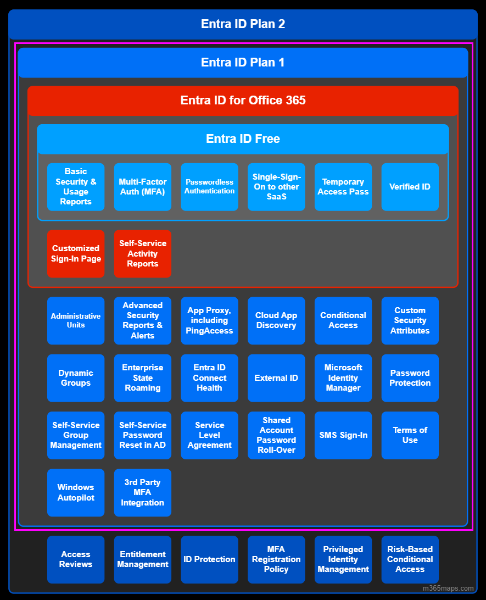

# Microsoft Entra ID Pläne (P1 & P2)

Microsoft Entra ID P1 und P2 sind Premium-Versionen, die im Vergleich zu den kostenlosen und Office 365 Editionen **zusätzliche Funktionen** bieten. Zu beachten gilt, dass für diese Premium-Versionen zusätzliche Kosten pro Benutzerbereitstellung anfallen. Diese sind in zwei Versionen erhältlich: P1 und P2. Dies kann entweder als **zusätzliche Lizenz** erworben werden oder als Teil von Microsoft Enterprise Mobility + Security, das auch Lizenzen für Azure Information Protection und Intune enthält.

Microsoft bietet eine Kostenlose Testphase an, in der wir die volle Funktionalität der Microsoft Entra ID P2-Edition testen können.

Im pink markierten Rechteck, sind alle Funktionen von der Entra ID P1 Lizenz aufgelistet. 
Darin sind folgende Funktionen enthalten:

- **Self-Service-Gruppenverwaltung**
  Es ermöglicht eine vereinfachte Gruppenverwaltung, indem Benutzern die Möglichkeit gegeben wird, Gruppen zu erstellen und zu verwalten, wobei Endbenutzer Beitrittsanfragen stellen und Gruppenbesitzer diese Anfragen genehmigen und ihre Gruppenmitgliedschaften verwalten können.
  
- **Erweiterte Sicherheitsberichte und Warnungen**
  Wir können den Zugriff auf unsere Cloud-Anwendungen überwachen und schützen, indem wir detaillierte Protokolle anzeigen, die erweiterte Anomalien und inkonsistente Zugriffsmusterberichte zeigen.
  Erweiterte Berichte basieren auf maschinellem Lernen und können uns helfen, neue Erkenntnisse zu gewinnen, um die Zugriffssicherheit zu verbessern und auf potenzielle Bedrohungen zu reagieren.
  
- **Multi-Faktor-Authentifizierung**
  Die vollständige Multi-Faktor-Authentifizierung (MFA) ist mit lokalen Anwendungen, Azure, Microsoft 365, Dynamics 365 und Drittanbieteranwendungen der Microsoft Entra-Galerie kompatibel. Sie ist jedoch nicht mit Standardanwendungen kompatibel, die nicht im Browser verfügbar sind, wie zum Beispiel Microsoft Outlook.
  
- **Lizenzierung von Microsoft Identity Manager (MIM)**
  Microsoft Identity Manager (MIM) kann in Microsoft Entra ID P1 oder P2 integriert werden, um Hybrididentitätslösungen zu liefern. Es kann verschiedene lokale Authentifizierungsspeicher wie AD DS, LDAP, Oracle und andere Anwendungen mit Microsoft Entra ID verbinden, was konsistente Benutzererfahrungen für lokale Branchenanwendungen und SaaS-Lösungen ermöglicht.
  
- **Enterprise-SLA von 99,9 %**
  Uns wird eine Verfügbarkeit des Microsoft Entra ID P1- oder P2-Dienstes von mindestens 99,9 % garantiert. Dasselbe SLA gilt für Microsoft Entra Basic.
  
- **Kennwortzurücksetzung mit Writeback**
  Die Self-Service-Kennwortzurücksetzung folgt der lokalen Active Directory-Kennwortrichtlinie.
  
- **Cloud App Discovery-Funktion von Microsoft Entra ID**
  Diese Funktion erkennt die am häufigsten verwendeten Cloud-basierten Anwendungen.
  
- **Bedingter Zugriff basierend auf Gerät, Gruppe oder Standort**
  Damit können wir den bedingten Zugriff auf kritische Ressourcen basierend auf mehreren Kriterien konfigurieren.
  
- **Microsoft Entra Connect Health**
  Mit diesem Tool erhalten wir betriebliche Einblicke in Microsoft Entra ID. Es arbeitet mit Warnungen, Leistungsindikatoren, Nutzungsmustern und Konfigurationseinstellungen und präsentiert die gesammelten Informationen im Microsoft Entra Connect Health-Portal.

In der Entra P2 gibt es dann zusätzlich folgende Funktionen:

- **Microsoft Entra ID-Schutz**
  Diese Funktion bietet erweiterte Möglichkeiten zur Überwachung und zum Schutz von Benutzerkonten, einschließlich der Definition von Benutzerrisiko- und Anmelderichtlinien. Sie ermöglicht auch die Überprüfung des Benutzerverhaltens und die Kennzeichnung von Benutzern als gefährdet.
  
- **Microsoft Entra Privileged Identity Management (PIM)** 
  Dies ist eine Funktion, die zusätzliche Sicherheitsstufen für privilegierte Benutzer wie Administratoren ermöglicht. Sie erlaubt die Definition von permanenten und temporären Administratoren und die Einrichtung eines Richtlinien-Workflows, der aktiviert wird, wenn jemand Administratorrechte zum Ausführen einer Aufgabe benötigt.
  

 
 

> [⇤ **Zurück zu "Lizenz Management"**](Azure_Theorie/LicenceManagement)  
> [⌂ **Zurück zur Hauptseite**](https://gitlab.com/e-portfolio1/hf-cloud-native-engineer/semesterarbeiten/semesterarbeit-1)