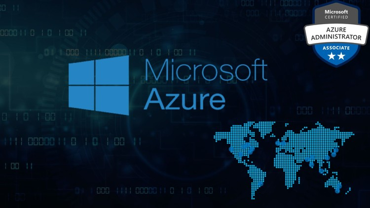

# Azure Theorie zur Zertifizierung zum AZ-104, Microsoft Certified: Azure Administrator Associate

> [!WARNING]  
> Aufgrund des Rückstandes des Projekts, wurde die Priorisierung angepasst und somit wird die Dokumentierung der Theorie zu einem Späteren Zeitpunkt fertiggestellt. 
> Weitere Infos können Sie unter [Entscheidung Priorisierung](Zwischenbesprechung2.md) einsehen.

 

In der Azure Welt gibt es viele Dienste. Im Rahmen dieser Semesterarbeit werden jedoch nur jene angeschaut, welche mit der Zertifizierung: **AZ-104, Microsoft Certified: Azure Administrator Associate** zu tun haben. 

Für die Vorbereitung auf die Zertifizierung, verwende ich Microsoft Learn, mit dem Kurs AZ-104, Microsoft Certified: Azure Administrator Associate. 

Dieser Kurs besteht aus folgenden Modulen: 

- Das in Deutsch -> (Prerequisites for Azure administrators)

Bei dieser Zertifizierung werden folgende Dienste / Themen im Azure angeschaut:

- **Azure Basics**
  - [Azure Ressource Manager](./Azure_Basics/Azure_Resource_Manager.md)
  - [Azure Cloud Shell](./Azure_Basics/Azure_Cloud_Shell.md)
  - [Azure Bash](./Azure_Basics/Azure_Bash.md)
  - [Azure PowerShell](./Azure_Basics/Azure_PowerShell.md)
  - [Azure Resource Manager-Template](./Azure_Basics/Azure_Resource_Manager-Templates.md)
  
- **Identity Management**
  - [Entra ID](./Identity_and_Governance/EntraID.md)
  - [Entra ID User und Gruppen](./Identity_and_Governance/EntraID_User_and_groups.md)

 
 

> [⌂ **Zurück zur Hauptseite**](https://gitlab.com/e-portfolio1/hf-cloud-native-engineer/semesterarbeiten/semesterarbeit-1)

