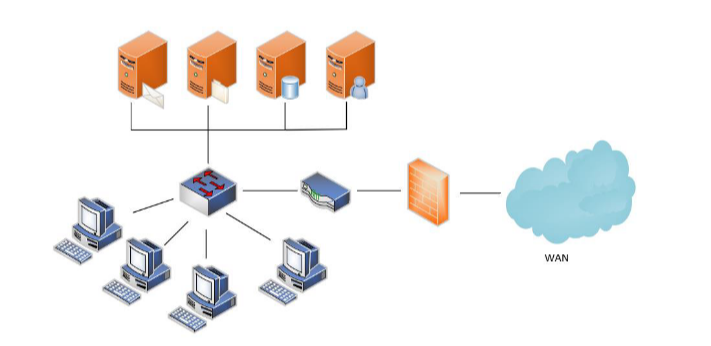
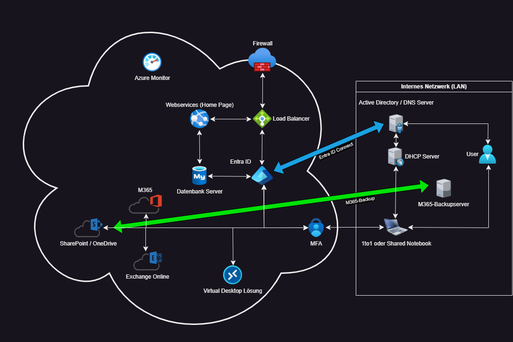

# Logische Pläne

Anhand der logischen Plänen, kann ich den soll- ist- Zustand aufzeigen, inklusive den Cloudeinstieg visuell darstellen. 

Da die Schule Muster eine reine on Premisse Umgebung ist, müssen hier einige Änderungen vorgenommen werden.

Die aktuelle Umgebung, sieht wie folgt aus:

 
*Logisches Layout der Schule Muster (Ist-Zustand)*

Wie wir sehen können, ist der ist-Zustand der Server folgendermassen:
- E-Mail-Server
- File-Server
- DB-Server
- Benutzerverwaltungs-Server (Domain-Controller)

Die Benutzer arbeiten in der Schule aktuell mit Desktop-Stationen, welche in einem Sternnetzwerk aufgebaut sind.
Das Sternnetzwerk bedeutet, jeder Client ist am selben Switch angehängt, welcher auch mit den Servern verbunden ist. 

Anschliessend gibt es noch den Router und die Firewall des ISPs (**I**nternet **S**ervice **P**rovider)

Da dies für die heutige Zeit sehr veraltet und nicht mehr dem neusten Standards entspricht, habe ich das gesamte Netzwerk neu geplant. 

Anhand des nachfolgenden Plans, sehen Sie dann den neuen soll-Zustand. 

*Logisches Layout der Schule Muster (Soll-Zustand)* 

Was genau geändert wurde, werde ich unter dem Abschnitt [Entscheidung](../03_Entscheidung/README.md) genauer drauf eingehen. 
