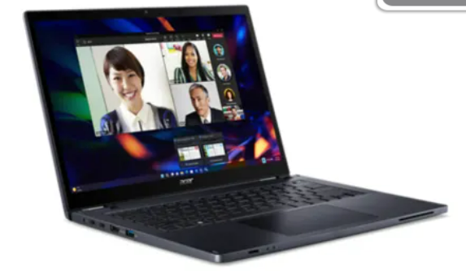

# Desktopablösung

Da die Schule Muster aktuell feste Deskop Clients hat, welche ein mobiles Arbeiten verhindern, müsste eine Lösung gefunden werden. 
Dafür gibt es mehrere Möglichkeiten. 
Was sicher Feststeht, ist dass die Arbeitsplätze in Modernworkplaces umgebaut werden müssen. Das heisst, dass theoretisch jeder an diesem Arbeitsplatz arbeiten könnte ohne dass man gleich alles neu einrichten müsste. 
Hierzu brauchen die Benutzer nur ein Notebook und ggf. ihr Headset. 

Die Ablösung der Desktop-Clients (FAT-Clients), besteht sozusagen aus zwei Teilen. 

1. Ablösung der Hardware
und
1. Ablösung der Datenspeicherung

Im ersten Schritt würde man die FAT-Clients durch Notebooks ersetzen, so kann man eine Modernworkplace-Kultur leben und für die Benutzer stellt sich dann auch die Möglichkeit dar, im Homeoffice zu arbeiten. 

Im zweiten Schritt müsste man nun den Zugriff auf die Daten, welche auf Laufwerken oder auch später vielleicht im Azure liegen zugreifen können. Wie ist das möglich aus dem Homeoffice oder einem Auswertigen Arbeitsplatzes?

Es gibt mehrere Möglichkeiten, dies zu machen. 
Einerseits könnte man dies mit einem VPN machen, was jedoch keinen sinn mach dies für 30 Mitarbeitenden einzurichten. 
Ein weiterer Aspekt ist der Datenschutz und die Datenintegrität. 
Über ein VPN können die Benutzer die Daten, wie Schüler- oder Personaldossiers oder weitere Sensitive Daten herunterladen.

Hier würde uns eine Virtual Desktop Infrastructure (VDI) in die Hände spielen. 

Doch was ist eine VDI?

VDI ist eine Technologie, die es ermöglicht, Desktop-Betriebssysteme auf zentralen Servern in einem Rechenzentrum zu hosten und diese an Endbenutzer über das Netzwerk zu liefern. 
Sie bietet Benutzern den Zugriff auf ihre persönlichen Desktop-Umgebungen von überall und mit jedem Gerät, das eine Internetverbindung hat. Zudem verbessert sie die Datensicherheit, da alle Daten zentral gespeichert und verwaltet werden.

#### Vorteile von VDI

- **Kostengünstige Implementierung**
  Mit VDI können Unternehmen die Hardwarekosten durch die Zentralisierung der Desktop-Verwaltung und -Bereitstellung senken.

- **Erweiterte Sicherheitsmassnahmen**
  Mit VDI werden Daten zentral gespeichert und verwaltet, wodurch das Risiko von Datenschutzverletzungen oder -verlusten verringert wird.

- **Erhöhte Flexibilität**
  VDI ermöglicht Benutzern den Zugriff auf ihre Desktops und Anwendungen von überall und mit jedem Gerät mit Internetverbindung.

- Verbesserte Mobilität und flexible Zugriffsmöglichkeiten für Mitarbeiter.

- Optimierte Sicherheitsstandards durch zentrale Datenhaltung und -verwaltung.

- Schnelle Anpassung an Unternehmensveränderungen und Skalierbarkeit.

#### Nachteile von VDI

- **Mögliche Leistungsprobleme**
  Wenn mehrere Benutzer über eine gemeinsam genutzte Infrastruktur auf virtuelle Desktops zugreifen, kann die Leistung beeinträchtigt werden.

- **Abhängigkeit von stabiler Netzwerkkonnektivität**
  VDI ist stark auf Netzwerkkonnektivität angewiesen.

- **Kompatibilitätsprobleme mit bestimmten Anwendungen und Hardware**
  Einige Anwendungen oder Hardware sind möglicherweise nicht vollständig mit VDI kompatibel.

- Anfängliche Komplexität der Einrichtung, die Netzwerkabhängigkeit, die Kosten der Infrastruktur und potenzielle Leistungsprobleme.

- VDI braucht mehr Rechenleistung und Speicherkapazitäten sowie zentralen Storage.

Wenn wir die Pro und Kontras einer VDI anschauen, sticht bei mir ein Thema besonders ins Auge.
Und zwar ist es der Punkt **Datensicherheit**. 
Ein grosses Plus für die VDI ist das Thema Datensicherheit. Es hat die Daten lokal in der Infrastruktur und die Daten können kaum auf die Hardware trasferiert werden.

## Welche VDI?

Es gibt viele Anbieter, welche VDI-Lösungen anbieten. 
Im nachfolgenden Abschnitt möchte ich anhand einer Evaluation aus drei gängigen VDI-Anbieter die beste Lösung ermitteln. 

| Anbieter                               | VMware                       | Citrix                                                                  | Azure Virtual Desktops        |
| -------------------------------------- | ---------------------------- | ----------------------------------------------------------------------- | ----------------------------- |
| **Plattform**                          | IaaS, PaaS                   | SaaS, PaaS, IaaS                                                        | Azure                         |
| **Hypervisor**                         | Only VMware vSphere          | Citrix Hypervisor, VMware vSphere, Microsoft Hyper-V, Nutanix Acropolis | Azure                         |
| **Storage-basiertes Image-Management** | Instant Clones               | Machine Creation Services                                               | Azure Storage                 |
| **Netzwerkbasiertes Image-Management** | Keines                       | Provisioning Services                                                   | möglich mit Intune zu managen |
| **Fehlersuche**                        | Horizon Help Desk Tool       | Director                                                                | Azure Portal                  |
| **App-Schichtung**                     | App Volumes                  | Citrix App Layering                                                     | Azure Storage                 |
| **Nutzermanagement**                   | Dynamic Environment Manager  | Workspace Environment Manager                                           | Microsoft Entra ID            |
| **Externer Zugang**                    | VMware Access Gateway        | Citrix ADC                                                              | Azure Portal                  |
| **VDI-Typen**                          | Persistent, Nicht persistent | Persistent, Nicht persistent                                            | Persistent, Nicht persistent  |
| **RDS-Unterstützung**                  | Ja                           | Ja                                                                      | Ja                            |
| **Azure-MFA-Unterstützung**            | Ja                           | Ja                                                                      | Ja                            |
| **HTML5-Client**                       | Ja                           | Ja                                                                      | Ja                            |
| **Cloud-Version**                      | Horizon Cloud                | Citrix DaaS                                                             | Azure Virtual Desktop         |
| **DaaS-Lösung**                        | VMware DaaS                  | Citrix DaaS                                                             | Azure Virtual Desktop         |
| **Remote display protocol**            | Blast Extreme                | HDX                                                                     | RDP                           |
Kosten Technisch gibt es verschiedene, jedoch muss man bei VMWare und bei Citrix diese anfragen, da die Möglichkeit besteht, dass es für öffentliche Dienste eine Vergünstigung gibt. 

Bei dieser Evaluation hat Azure Virtual Desktop die Nase vorn, da die Dienste, welche es braucht bereits im Einsatz sein werden (Beispielsweise: Entra ID oder Intune für die Notebookverwaltung). 

## Welche Notebooks sollten verwendet werden?

Da die Desktopablösung nicht nur mit Azure Virtual Desktops gelöst wird, müssten wir theoretisch auch die Hardware dazu besorgen, damit die Benutzer sich auf die VDIs verbinden können. 
Da dieses Projekt mit dem Cloudeinstieg zu tun hat, gebe ich hier nur ein Model als referen an. jene Peripherie und sonstiges Material würde durch einen andere Abteilung offeriert werden und auch eingeplant. 

Als Referenz für ein ungefähres Pricing, nehme ich das Acer TravelMate Spin P4.

*Acer TravelMate Spin P4 für die Mitarbeitenden der Schule Muster*

Die Notebooks würden dann über Intune verwaltet werden. 

