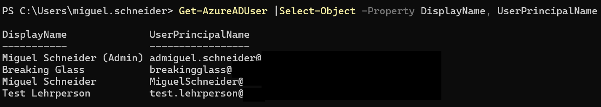
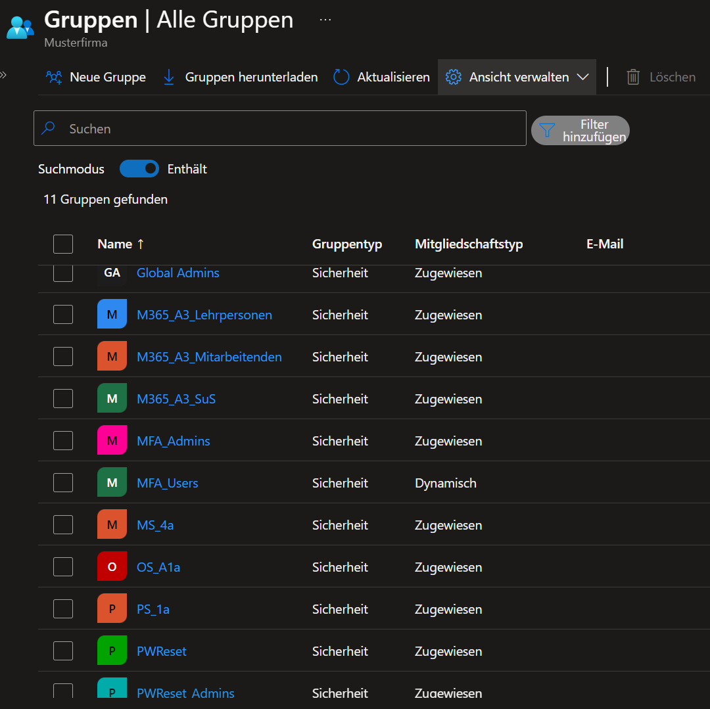
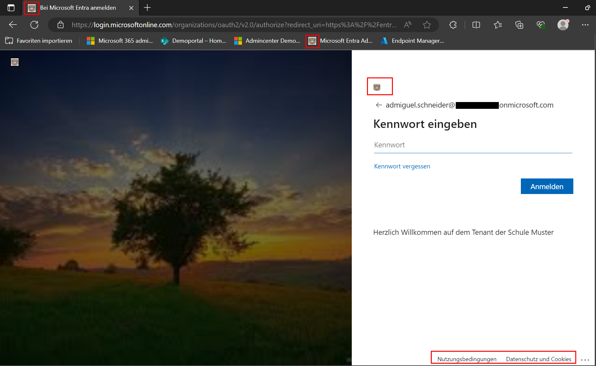
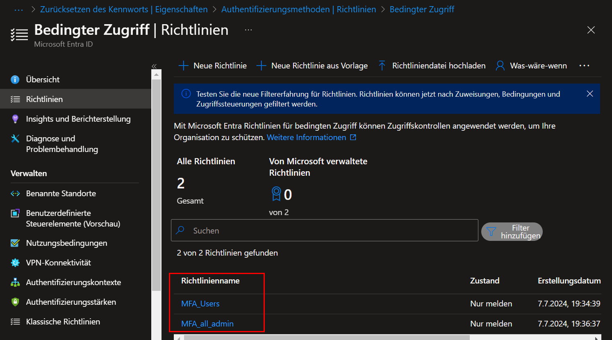
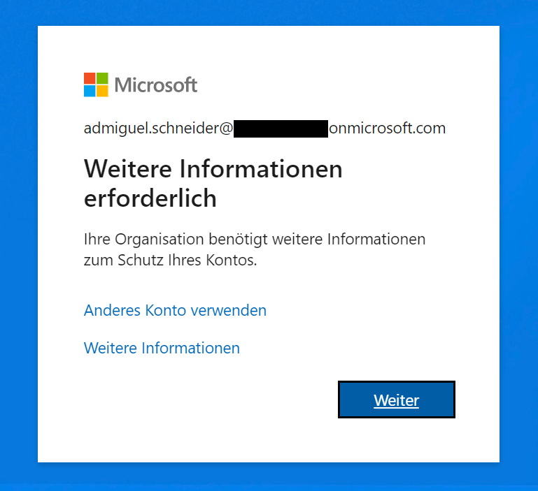
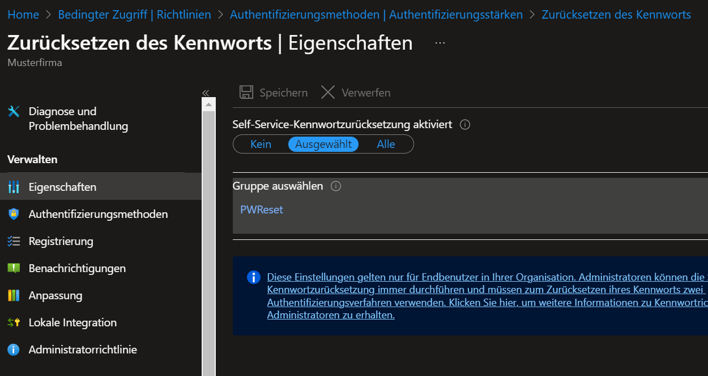
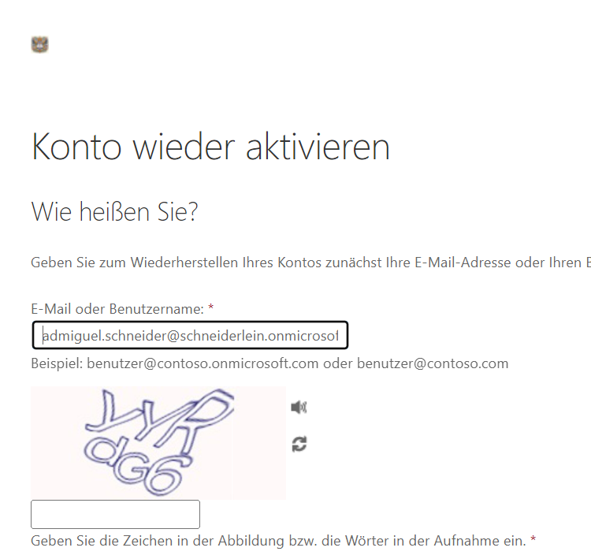
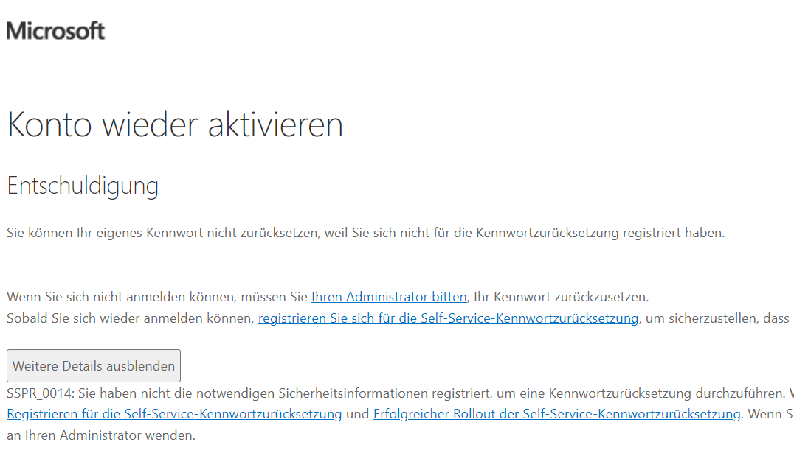

# Identity Management (Entra ID)

Im Identity Management werden alle Benutzer, Gruppen und Zugänge zu allen Microsoftdiensten gesteuert. 
In Microsoft übernimmt dies das Entra Identitiy (Entra ID, ehemals Azure AD). 
Nachfolgend wird eine Realisierung des Identity Management beschrieben:
## Einrichtung Hybridschnittstelle

Da die Schule Muster bis jetzt nur ein lokales AD hatte, wird neu eine Hybridschnittstelle eingerichtet mit dem Entra ID Connect, welcher die Daten zwischen dem AD und dem Entra ID synchronisiert. Damit dies möglich ist, muss einerseits der Entra ID Connect auf einem Server installiert werden, welcher auf das AD zugriff hat. Anschliessend werden die zu synchronisierenden Organisation Units (OU), Attribute welcher der Connect synchronisieren soll und der Passwort Hashsync konfiguriert. 
Mit diesen wenigen Schritten ist bereits die Hybridstelle für die Benutzerverwaltung erstellt. 

## Benutzerverwaltung

Die Benutzerverwaltung wird primär über das Active Directory (AD) gemacht. Da wir eine Hybridstelle konfiguriert haben, hat das AD die Hoheit über die Benutzer. 
Wichtig zu beachten ist, dass dies nur für Synchronisierte Benutzer betrifft. 

### Benutzererstellung 

Da eine Hybridschnittstelle eingerichtet ist, empfiehlt es sich, dass die Benutzer weiterhin im AD erstellt werden. 

Wir haben dafür eine Eigenentwickelte Applikation dafür: 

Der **ISE IntranetAdmin** ist eine User Lifecycle Applikation für die automatisierte Synchronisation von Benutzerkonten, Gruppen, Gruppenmitgliedschaften und der Zuteilung benötigter Ressourcen und Berechtigungen on-premise und in der Microsoft 365 Cloud. Das Tool bietet eine professionelle und flexible Automatisierung des Benutzermanagements – von der Erstellung über die Aktualisierung bis hin zur Archivierung oder endgültigen Löschung von Accounts und Ressourcen.

#### Vorteile des IntranetAdmin

- Import von personenbezogenen Daten aus verschiedenen Datenquellen wie CMI LehrerOffice, Escada, Escola, Djooze, EcoOpen, CSV-Dateien und SharePoint-Listen.
  
- Verwaltung von Accounts und Gruppen im Active Directory oder in der Microsoft 365 Cloud.
  
- Erstellung von persönlichen Ressourcen wie Home-Laufwerk, Profil- oder Gruppenlaufwerke und Mailpostfächern.
  
- Zuweisung zu Klassen oder Kursen in Microsoft Teams.
  
- Erstellung, Verwaltung, Archivierung und Löschung von Klassen und Kursen in Microsoft Teams.
  
- Generierung von persönlichen Loginblättern bzw. Gruppenlisten.
  
- Export der Daten für den Import in LehrerOffice, Apple School Manager oder LMVZ.
  
- Erstellung von Loginblätter

Mit dieser Applikation können wir gleich mit einem Schlag, die Zeit und Aufwände der Benutzererstellung reduzieren, da dies voll automatisch im Hintergrund läuft. 
Täglich gibt es Logs und ein ChangeReport, in dem man getätigte Änderungen einsehen kann und allfällige Fehler gleich erkennen kann. 

Ein genaues Konzept und vorgehen kann nach einer Analyse und Vorbesprechung ausgearbeitet werden. 

#### Namenskonzeption

Das [Namenskonzept](./Nameconcept.md) wird gemäss der definition umgesetzt: 
##### UserPrincipalName (UPN)

| Funktion      | UPN                                    |
| ------------- | -------------------------------------- |
| Lehrpersonen  | vorname.nachname@schulemuster.ch       |
| Mitarbeitende | vorname.nachname@schulemuster.ch       |
| Lernende      | vorname.nachname@schulemuster.ch       |
| Admins        | "ad"+ vorname.nachname@schulemuster.ch |

###### Regeln für die Erstellung des UPNs

Neue Benutzer haben noch keinen userPrincipalName. Dieser wird durch den Sync generiert. Die Regeln, um Spezialfälle abzufangen, sind standardmässig so definiert:

- Wenn derselbe Vor- und Nachname mehrmals vorkommt, wird nach dem Namen automatisch eine Zahl in aufsteigender Folge gebildet (also z.B. vorname.name2@schulemuster.ch).

- Bei langen Vor- oder Nachnamen bzw. bei Verwendung von Doppelnamen wird folgende Regel in der auf-geführten Reihenfolge zur Bildung des UPN angewandt:

	- Alle Zeichen werden klein geschrieben (Max > max)

	- Sonderzeichen werden entfernt (peter? > peter)

	- Umlaute werden ersetzt (ö > oe)

	- Buchstaben ausserhalb der gängigen ASCII-Tabelle werden durch übliche Zeichen ersetzt (beispielsweise è durch e)

	- Doppelspaces werden mehrfach durch Space ersetzt (hans   peter > hans peter)

	- Wörter werden beidseits getrimmt ( max  > max)

	- Abstände nach führenden Präpositionen in Nachnamen werden entfernt (da costa -> dacosta)

- Es dürfen nie 2 identische UPN vorkommen, und die Logins müssen eine gültige E-Mail-Adresse repräsentieren (Regular-Expression Prüfung).

Im der nachfolgenden Abbildung zeige ich die erstellten Benutzer. 
Nebst einem Admin Account und einer Test-Lehrperson, gibt es zusätzlich einen Breaking Glass Account. Dieser Account wird dafür verwendet, dass falls eine Tenanteinstellung auch alle Admins aussperrt, sollte der Breaking Glass Account sich immer noch einloggen können. 
Dieser Account wird mit einem sehr langen Kennwort versehen und zusätzlich kann man mit Azure Monitor die Logins überwachen und sich so eine Alarmierung einrichten, sobald sich der Benutzer anmeldet. 

*Benutzer der Schule Muster* 

## Gruppenerstellung 

Bei der Gruppen Erstellung erstellen wir standardmässig Lizenzgruppen, Klassengruppen, Sicherheitsgruppen und E-Mail-aktivierte Sicherheitsgruppen. 

Die Gruppen werden anhand des [Namenskonzepts](Nameconcept.md) erstellt.

Die standardgruppen, welche wir erstellen, wären folgende. 
Je nach Anforderung kann es auch mehr Gruppen geben.

| Gruppenname           | Typ                          | Beschreibung                                                                                                                                                                                      |
| --------------------- | ---------------------------- | ------------------------------------------------------------------------------------------------------------------------------------------------------------------------------------------------- |
| Global Admins         | Sicherheitsgruppe            | Über die Gruppe Global Admins, erhällt jeder Benutzer darin die Rolle Globaler Administrator                                                                                                      |
| M365_A3_Lehrpersonen  | Sicherheitsgruppe            | Lizenzgruppe für Lehrpersonen                                                                                                                                                                     |
| M365_A3_Mitarbeitende | Sicherheitsgruppe            | Lizenzgruppe für Mitarbeitende                                                                                                                                                                    |
| M365_A3_SuS           | Sicherheitsgruppe            | Lizenzgruppe für **S**chülerinnen **u**nd **S**chüler                                                                                                                                             |
| MFA_Admins            | Sicherheitsgruppe            | Sicherheitsgruppe für Bedingten Zugriff für Admins                                                                                                                                                |
| MFA_Users             | Dynamische Sicherheitsgruppe | Sicherheitsgruppe für Bedingten Zugriff für aller Benutzer, ausser Admins und Schüler.                                                                                                            |
| PS_1a                 | Sicherheitsgruppe            | Klassengruppe                                                                                                                                                                                     |
| PWReset               | Sicherheitsgruppe            | Sicherheitsgruppe für selbstständigen Passwortreset                                                                                                                                               |
| PWReset_Admins        | Sicherheitsgruppe            | Über diese Gruppe erhalten bestimmte Benutzer die Rolle Helpdeskadministrator über.  Mit diesen Berechtigungen können Sie allen Benutzer, welche nicht Admins sind, das Passwort zurücksetzen. |
In der nachfolgenden Abbildung zeige ich einige der genannten Gruppen auf. 

*Gruppen der Schule Muster*

Da ich zur Zeit keinen Exchange Online in betrieb habe, kann ich leider nicht die E-Mail-aktivierten Sicherheitsgruppen zeigen, da diese über den Exchange verwaltet werden. 
Diese Gruppen würden jedoch dann als E-Mail-Verteiler fungieren. 

## Loginseite

Bei jedem Login erhalten wir standardmässig die Seite von Microsoft zu sehen. 
Dies kann man Tenant weit einstellen, indem man sein Firmenlogo und einen Hintergrund hinzufügt. 

*Loginseite der Schule Muster* 

Auf dieser Loginseite habe ich ein kleines Wappen durch Copilot erstellen lassen, welches ich als Organisationswappen hinterlegt habe. Zusätzlich habe ich den Loginbereich rechtsbündig gemacht, anstelle von dem zentralen Fenster und einen Hintergrund hinzugefügt. 
Des weiteren kann die Schule ihre Nutzungsbestimmungen und Datenschutzrichtlinien hinterlegen (unten rechts markiert).

## Bedingter Zugriff

Der bedingte Zugriff wird von vielen Benutzern als mühsam bezeichnet. 
Dies nur, weil sie etwas mehr Zeit benötigen, um sich zu authentifizieren. 
Mit dem Bedingten Zugriff, können wir jedoch die Mehrheit der Angriffe auf ein Konto minimieren, was zugunsten für die Endbenutzer ist. 

Da der bedingte Zugriff in Zusammenhang mit der IT-Sicherheit zu tun hat, verwenden wir den Benchmark Katalog, von Microsoft, welcher uns einige Empfehlungen zur Sicherheit des Tenants mitgibt. 
Anhand dieses Dokumentes, wurde bei uns intern ein Dokument erstellt, welches unsere Empfehlungen beinhaltet. Darunter auch den bedingten Zugriff.

Beim bedingten Zugriff, unterscheiden wir zwischen Administratoren und Endbenutzern. 
Dies ist so, weil ein Administratorkonto stärker gesichert ist als ein Konto eines Endbenutzers. 

In diesem Fall ist es so, dass ich sowohl für Administratoren als auch für Benutzer jeweils eine separate Richtlinie einrichte. 

### Bedingter Zugriff für Admins

Für die Admins habe ich in der Richtlinie nur Anmeldungen aus der Schweiz erlaubt und bei jeder Anmeldung muss eine Multifaktor-Authentifizierung-Abfrage stattfinden. 
Des Weiteren weise ich die Sicherheitsgruppe `MFA_Admins` hinzu, inkl. jeder Benutzer, welcher die Rolle `Globaler Administrator` besitzt. 

### Bedingter Zugriff für Endbenutzer

Bei den Endbenutzern lockere ich die Richtlinie etwas. 
Die Benutzer können sich aus der Schweiz und den umgebenen Ländern Anmelden. 
Falls ein Endbenutzer einmal ins Ausland für längere Zeit geht, beispielsweise in den Ferien, so kann man dieses Land in der Richtlinie öffnen. 
Wie bereits erwähnt, finden Endbenutzer die MFA eher störend.
Damit sie sich nicht jedes mal neu authentifizieren müssen, wird in der Richtlinie definiert, dass eine MFA alle 7 Tage abgefragt wird. 
Dies ist aber nur für den jeweiligen Dienst so. Falls sich ein Endbenutzer bei einem Dienst effektiv abmeldet, so wird eine erneute Abfrage verlangt, da der Token wie neu erstellt wird. 
Ausserdem wird auch noch eingestellt, dass wenn sich der Benutzer im internen Netzwerk befindet, keine MFA abgefragt wird. Dies wird mit der öffentlichen IP überprüft und eingerichtet. 

Die beiden Richtlinien sind nun erstellt und beim nächsten Login werden dann die Benutzer zur Registrierung der MFA aufgefordert.

*Bedingter Zugriff Schule Muster*

*MFA wird beim nächsten Login verlangt*

## Passwort zurücksetzen

Wer kennts nicht. 
Man möchte sich einloggen und man hat sein Passwort vergessen. 
Ein neues Ticket bei der IT zu eröffnen oder persönlich vorbeigehen dauert nun zulange und ich müsste mich jetzt einloggen können. 
Dafür gibt es den Selfservice zum das Passwort zurücksetzen. 

Für den Selfservice gibt es mehrere möglichkeiten.
Entweder man stellt ihn allen zur Verfügung oder nur einer bestimmten Gruppe. 
Aus meiner Sicht macht dies durchaus sinn, nur für gewisse Personen den Service zur Verfügung zu stellen. 
Aus diesem Grund gibt es auch die Sicherheitsgruppe `PWReset`. 
Alle Benutzer welcher in dieser Gruppe sind, können ihr eigenes Passwort zurücksetzen. 

*Einrichtung Selfservice für das Passwort zurücksetzen*

*Benutzer ist in der Gruppe und kann PW-Zurücksetzen*

*Benutzer ist nicht in der Gruppe drin und kann das Passwort nicht selbst zurücksetzen*

### Passwort durch Admins zurücksetzen (Nicht IT)

Da die IT auch einmal verhindert sein kann und die Schüler ihre Passwörter nicht selbst zurücksetzen können, ist es sinnvoll, wenn man TICTs oder PICTs die Möglichkeit gibt, die Passwörter zurückzusetzen.
Mit der Rolle Helpdeskadministrator, können bestimmte Lehrpersonen die Passwörter von nicht Administratoren zurücksetzen. 
Diese Rolle wird den Benutzern über die Sicherheitsgruppe `PWReset_Admins` vergeben. 

 
> [⌂ **Zurück zur Projekthauptseite**](../README.md) 

