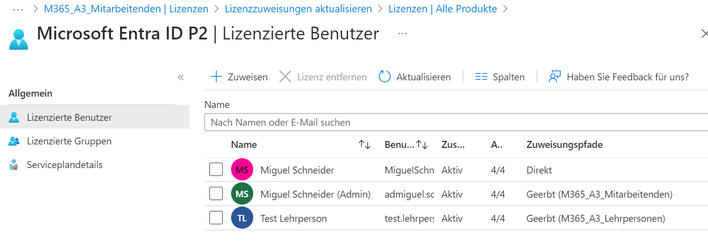

# Lizenz Management

Im Lizenz Management gibt es wenig zum sagen. 
Dadurch, dass es sich hier um eine Schule handelt, werden Education Lizenzen eingesetzt. 
Um da den besten Vertrag/Bedingungen zu ermitteln und zu verhandeln, muss dies zuerst mit unserem Lizenzhändler angeschaut werden. 
In der Schweiz können nur noch wenige Firmen Education-Verträge für Microsoft abschliessen. 
Die Abklärungen machen wir mit dem Lizenzhändler. Der Vertrag würde dann zwischen dem Lizenzhändler und dem Kunden erfolgen. 
Sobald dann die Lizenzen im Tenant ersichtlich sind, können wir dann mit der Verwaltung des Tenants beginnen. 

Die Tiefste Lizenzierung liegt bei einer Education A1. In dieser Lizenz sind die Basics vorhanden, wie Teams, SharePoint und Exchange Online. Ein wichtiger Punkt ist, dass lokale Apps darin nicht integriert sind, sondern nur die Webapps. 
Wenn mit dieser Lizenz gearbeitet werden will, so müsste eine weitere Lizenz für die Lokalen Apps dazu geholt werden. 

Eine Lizenz höher, ist die Education A3 Lizenz, welche die selben Dienste wie die A1 hat und zusätzlich weitere Dienste verfügt, wie die Lokalen M365 Apps, Entra ID P1 wie für den Bedingten Zugriff (MFA), mehr OneDrive Speicher, etc. 

Die nächste und letzte Lizenzstufe, wäre die A5, welche zusätzlich von der A3 weitere Dienste im Bereich Security und Compliance beinhaltet. 
Dazu gehörten Entra ID P2 und weitere Defender-Dienste.

## Lizenzzuweisung

Die Lizenzzuweisung findet über Gruppen statt. 
Wir haben dafür unter den Gruppen 3 Lizenzgruppen erstellt 

*Lizenzgruppen (M365_A3_`*`)* 

Der Vorteil einer Gruppenlizenzierung ist, dass die Benutzer in einer gruppe sind und sobald sie dann entfernt werden auch gleich die Lizenz verlieren. 

Im Portal ist die Lizenzierung wie folgt zu erkennen: 
Als Beispiel verwenden wir die Microsoft Entra ID P2.

*Lizenzierte Gruppen Schule Muster*

Bei der Benutzerübersicht kann man dies auch sehen, inklusive über welche Gruppe sie die Lizenz erhalten. 

*Lizenzierte Benutzer der Schule Muster* 

Genau sehen kann man das, unter der Spalte `Zuweisungspfade`
Da gibt es die Werte `Direkt` oder `Geerbt (Gruppe)`

