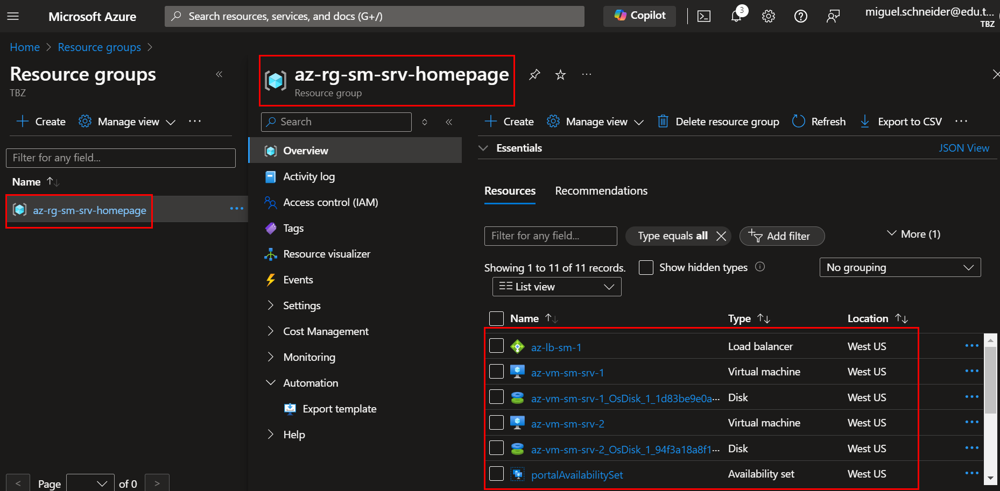
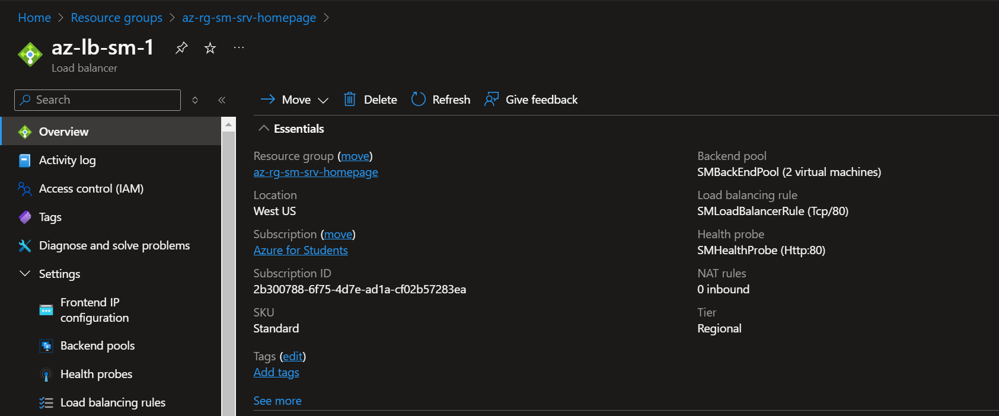
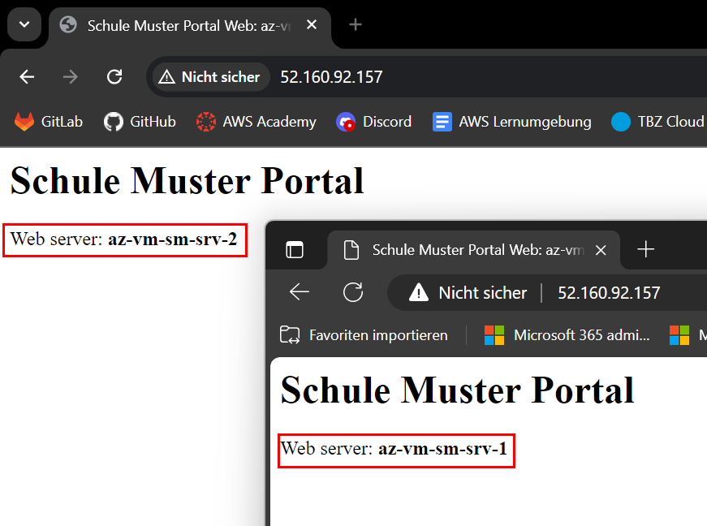
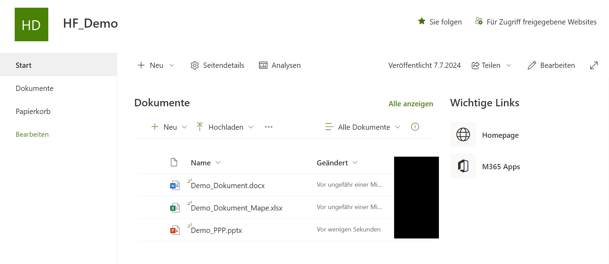

# Serverablösung

Bei der Serverablösung geht es darum, dass wir die on-premise Server in die Cloud migrieren können. 
Bevor eine Migration überhaupt durchgeführt werden kann, muss durch den Kunden entschieden werden, was genau umgesetzt werden soll. 
Anhand der folgenden Demonstrationsbeispielen, möchte ich diverse Möglichkeiten aufzeigen. 

Wie bereits im Abschnitt Entscheidung erläutert, werden die verschiedenen Server durch Dienste und Servern im Azure ersetzt. 

## Webserver

Der Webserver, welcher unteranderem die Homepage der Schule Muster hostet, würde durch die Ressourcen Loadbalancer und VMs erstellt werden. 
Es gibt zwar mehrere Möglichkeiten um eine Website zu übernehmen (App Services, Container Apps, etc.).

Für die Demonstration, möchte ich dies im kleinen Rahmen demonstrieren, was wir im grossen dann umsetzen würden. 

Damit die Homepage agil und jeder Zeit erreichbar bleibt, erstellen wir min. zwei VMs, welche mit einem Loadbalancer und Autoscaler zusammen arbeiten. 
Den Loadbalancer ist für den Lastenausgleich zuständig. 
Er verteilt die Benutzeranfragen an die verschiedenen Servern. 

Mit dem Autoscaler verhindern wir, dass die Auslastung der Homepage bei vielen Anfragen nicht überschritten wird. 
Bei einem Bestimmten Wert, beispielsweise CPU > 90% Auslastung, würde eine weitere VM erstellt werden, welche Identisch ist wie die andere und dem Frontendpool hinzugefügt werden. 
So hat der Loadbalancer neu eine neue VM, auf welcher er weitere Anfragen gleichmässig verteilen kann. 

Sobald die Last dann wieder abnimmt, beispielsweise in der Nacht, würde anhand einer Prüfung des Autoscalers wieder auf das Minimum, zurückgestellt werden. 

Mit dieser Technik können wir die Kosten auf dem Minimum halten, denn wir erhalten nur das in Rechnung gestellt über, was wir defektiv brauchen. 

Im Backend, würden dann DBs mit den gebrauchten Daten stehen, welche wir Zonen-Redundant aufbauen würden. 
Bei diesem bespiel wurden jedoch die DBs durch eine VM abgebildet. Dies würde jedoch dann durch SQL DBs betrieben werden. 

### Demo

Eine Demo, welche zum jetzigen Zeitpunkt ausgeführt werden kann, gibt es nicht. 
Ich möchte dies jedoch in der Dokumentation mit Screenshots aufzeigen. 
Am Tag der Präsentation würde dann eine Demo stattfinden.

Um die Demoumgebung aufzubauen, kann das Script [setup_enviroment_loadbalancer_and_homepage.sh](setup_enviroment_loadbalancer_and_homepage.sh) verwendet werden. 
Wichtig zu beachten ist, dass die Setup-Dateien, in einem Repo stehen, welches nur mit einem Access-Token von mir herunter geladen werden können. 

In dieser Demo zeige ich auf, wie wir den Loadbalancer eingerichtet haben und wie das mit einer Homepage ablaufen würde.

Beim erstellen der Ressource, beachten wir zusätzlich das [Namenskonzept](Nameconcept.md), welches wir im vorhinein definiert haben. 

*Ressourcen in Ressourcengruppe markiert*

Wie wir hier sehen können haben wir in der Ressourcengruppe einen Loadbalancer, zwei VMs, deren SSDs, etc. 

Die Konfiguration des Loadbalancers sieht folgendermassen aus:
 
*Config Loadbalancer* 

Ansonsten kann auch das JSON über diesen Link angeschaut werden: [JSON Config Loadbalancer](loadbalancerconfig.md) 

Die VMs werden über ein Cloud-Init-File erstellt, welches einen NGNX-Webserver installiert und auch gleich eine Demo Homepage, auf der aktuell ersichtlich ist, auf welchem Server wir uns befinden.

*Demowebsite*
Wie wir in dieser Abbildung sehen können, haben wir über zwei Browserprofile eine Anfrage auf die selbe IP-Adresse Durch den Loadbalancer werden die Anfragen dann auf die verschiedenen VMs aufgeteilt. 

Diese Demo zeigt uns, wie eine Aufgleisungs eines Loadbalancer bei der Schule Muster nützen kann. 
Die IP, welche aktuell verwendet wird für den Aufruf, würde dann mittels eines DNS zu einer URL umgewandelt werden, Bsp.: Schule-Muster.ch 

## Office Applikationen (E-Mail, Daten, etc.)

Um diverse Daten von den File-, E-Mailservern, etc. zu Migrieren, haben wir diverse Spezialisten bei uns im Team, welche diese Arbeiten fast Täglich machen. 
Das Wichtigste an einer solchen Migration ist die Planung, welche mit den Spezialisten stattfindet. 

### E-Mails
Um den E-Mail-Server abzulösen, richten wir keine Hybridstelle ein, sondern migrieren dies gleich ins Exchange Online.

### Daten

Auf den Fileservern gibt es bestimmt viele Daten, wie Benutzerlaufwerke (Homes), Gruppenlaufwerke, welche Beispielsweise an Fachschaften angehören und sonstige Daten. 

Benutzer Laufwerke wie Homes, werden bei uns standartmässig in OneDrive migriert . 
Die OneDrives sind nachher nur noch für den Benutzer zugänglich und er kann dann auch die Dateien an andere Freigeben. 

Bei Gruppenlaufwerken, ist es sinnvoll dies über ein Team zu steuern, denn über ein Team, kann man sich auch gleich austauschen, falls mal was geändert wurde und gleich alle erfahren es. 
In einem solchen Team kann man auch wiederum diverse Apps von Microsoft mit verwenden, Notizbücher mit OneDrive erstellen, wo man dann auch miteinander arbeiten kann. 

Für alle anderen Dateien, welche für Alle allgemein zugänglich sein sollen, kann man entweder dies im SharePoint auf einer SharePoint Site speichern. 
Es gibt zwar auch die Möglichkeit dies über einen Azure Storage Blob zu speichern aber da SharePoint auch gleich in er Education-Lizenz integriert ist, macht es durch aus sinn, dies im SharePoint zu speichern. 

 
*SharePoint Demosite*

## Backup

### Azure Ressourcen Backup

Beim Backup, geht es mehrheitlich darum, die wichtigen Daten zu sichern. 
In dieser ganzen Umgebung gibt es aus meiner Sicht nur die SQL-Datenbank, welche speziell gesichert werden müssen. Die VMs erhalten die Website via Cloud-Init-Files und sind somit innerhalb von ca. 4-5 min wieder aktiv, weshalb ich hier den Drang für ein Backup nicht sehe, wäre aber machbar. 

#### Wie würden wir die Daten Sichern?

Mit Azrue Backup Service können wir gleich speziell die SQL Datenbank sichern. folgende vorteile bietet uns hier Azure:
1. Workloadabhängige Sicherungen, die alle Sicherungstypen unterstützen: vollständige, differenzielle und Protokollsicherungen
2. RPO (Recovery Point Objective) von 15 Minuten mit häufigen Protokollsicherungen
3. Zeitpunktwiederherstellung von bis zu einer Sekunde
4. Sicherung und Wiederherstellung einzelner Datenbankebenen

### M365 Backup

Für die Daten, welche auf M365 (SharePoint, Teams, E-Mail) gespeichert sind, haben wir bei uns das Active Backup für M365. Beim Kunden würde ein NAS (on-premise) eingerichtet werden, welches dann alle Daten von M365 bei sich sichert. Über die Sicherung ist es dann möglich, E-Mails oder SharePoint-Daten wiederherzustellen. 

Dies könnte dann auch ergänzt werden mit einem Tapeschreiber, um dies auch auf Tapes zu sichern.

 
> [⌂ **Zurück zur Projekthauptseite**](../README.md)

