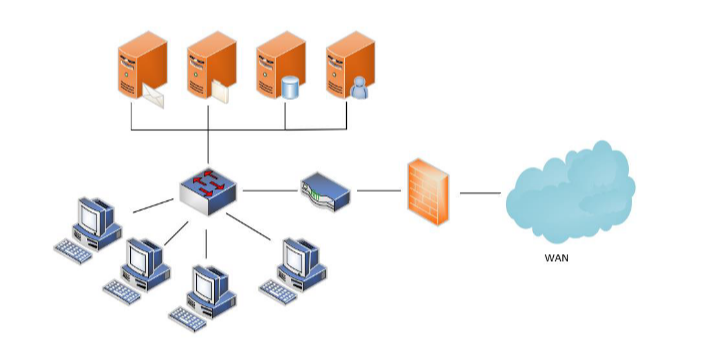
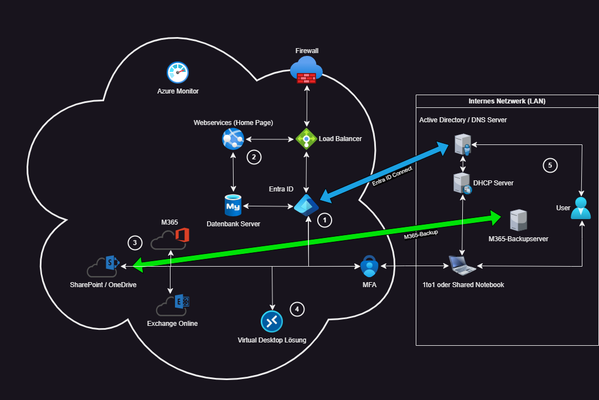

# Vergleich zwischen Ist-Zustand und Soll-Zustand

Anhand des Cloudeinstiegs der Schule Muster, werden einige Dienste und Server entweder abgelöst oder Migriert. 
Auf dieser Site wird  beschrieben, wie ich die Dienste in die Cloud integrieren würde. 
Als Basis zum Vergleich verwenden wir den Ist-Zustand und vergleichen dies mit dem Soll-Zustand. 
 
*Ist-Zustand der Schule Muster*

*Soll-Zustand der Schule Muster*

Anhand der Nummerierung auf dem Bild "Soll-Zustand", werde ich nachfolgend erläutern, wie wir die Dienste oder Instanzen in die Cloud migrieren oder integrieren. Wie wir einen Dienst ablösen, wird anhand der [7Rs](./Images/way_to_the_cloud.png) angegeben 

1. **Entra ID**
   Bis zum 1. Oktober 2023 hiess es noch Azure AD, als sich Microsoft dazu entschied, das Azure AD (AAD) in Microsoft Entra ID um zu nennen. 
   Seit diesem Tag an, wird das Identity Access Management (IAM) unter Entra ID geführt. 
   Der Dienst wird im Azure betrieben und ist für die ganze Benutzer- und Gruppenverwaltung zuständig. 
   In diesem Projekt richten wir eine Hybridschnittstelle ein, da es weiterhin ein on-premise Active Directory geben wird. 
   Für die Schnittstelle wird der Entra ID Connect verwendet. 
   Mit dem Microsoft Entra ID wird auch gleich die Multifaktor Authentifizierung mit eingeführt, welche für einen zusätzlichen Schutz dient. 
   
   In diesem Fall würden wir ein Lift & Reshape anwenden, da wir das Entra neu einbeziehen und die aktuell vorhandene Infrastruktur (AD on-premise) anpassen werden, mit dem Entra ID Connect. 

2. **Webservice**
   Da der Webservice (Homepage und ähnliches) bis anhin on-premise gehostet wurden, wird der Webserver, mitsamt des SQL-Servers in die Cloud Migriert. 
   Bei diesem Schritt würde die SQL-Datenbank (SQL-DB) in die Cloud migriert werden, der Webserver und ein Loadbalancer würde neu erstellt werden. 
   
   In diesen Fällen würden wir die SQL-DB nach dem Lift & Shift Prinzip migrieren, den Webserver und Loadbalancer würden dann nach dem Drop & Shop Prinzip erstellen. 
   
   Viele Fragen sich nun, weshalb Drop & Shop, dies wird verwendet damit wir gleich in der Cloud mit einem Autoscaling die Last und Kosten tief halten können. Falls es während einer bestimmten Zeit einen Ansturm auf die Seite gibt, dann können wir mit dem Autoscaler dies überwachen und so zusätzliche Instanzen hochfahren, welche dann für das Hosting der Website zur Verfügung stehen. 
   Wenn die Last dann wieder abfällt, werden die Instanzen auch wieder heruntergefahren. 
   Dies hat den Vorteil, dass wir so die kosten auch so tief wie möglich halten können. 
   Es gibt dann die minimale Anzahl von 1-2 Instanzen, welche sich dann im Falle des Ansturms vermehren. 
   
3. **Microsoft Applikationen**
   Die Microsoft Apps welche bis anhin lokal mit einem Mak Key installiert wurden, werden neu mit einer Microsoft Education Lizenz lizenziert. NEbst dem, dass wir die Apps lokal nutzen können, können wir mit dieser Lizenz neu auch über die Webapps die Dokumente verwenden. 
   Neu gibt es anstelle eines Fileservers, wo die einzelnen Home-Laufwerke waren, das OneDrive, welches auf dem SharePoint gehostet ist. 
   Mit SharePoint, Teams und OneDrive können Dateien gespeichert und mit den Benutzern geteilt werden.
   
   **OneDrive**: 
   Das OneDrive ist der persönliche Speicher für die Benutzer. Jeglicher Fremd zugriff ist nur duch die Admins möglich und aufgrund des Datenschutzgesetzes der Schweiz ist dies auch nur möglich mit der Schriftlichen Zustimmung des Benutzers. 
   Der Benutzer kann in seinem OneDrive, Dateien einzelner Benutzer und Gruppen freigeben.
   
   **Teams**
   Microsoft Teams ist eine Plattform auf der mehrere Benutzer in einem Team sein können und so Gruppenarbeiten machen können. 
   Die Speicherplattform von jedem Team ist die jeweilige Teamsite, welche auf dem SharePoint liegt. 
   Darauf haben nur die Mitglieder und Besitzer des jeweiligen Teams zugriff. 
   Weitere Zugriffe könnten über SharePoint geregelt werden, dies ist jedoch nicht Empfohlen. 
   
   **SharePoint** 
   Auf dem SharePoint können allgemeine Datenablagen erstellt werden. 
   Vergleichbar ist dies mit einem Intranet. 
      
   Mit diesen Microsoft Diensten, würde ich den Dateiserver ablösen. 
   Die Daten werden somit von überall erreichbar und können gar auf den lokalen Client synchronisiert werden. 
   
   In diesem Fall würde ein Lift & Shift verwendet werden. Dies, weil wir die Daten von Fileserver übernehmen und ins M365 Migrieren.
   
   **E-Mails**
   Der E-Mail-Server wird durch das Exchange Online abgelöst, was bedeutet, wir würden mit einem Lift & Shift die Daten migrieren und anschliessen den Exchange on-premise entfernen. 
   Dies würde zwar auch ein Drop & Shop machen, jedoch migrieren wir hier die Daten vom alten Server, weshalb dies für mich eher in ein Lift & Shift oder auch ein Lift & Reshape gehen würde.
   
4. **Desktopablösung**
   Mit der Desktopablösung wird gemeint, die mögliche Virtualisierung der Arbeitsstationen der Mittarbeitenden. 
   Dazu gibt es eine Separate Evaluation:
   [Evaluation Desktopablösung](./Desktopreplacement.md)   

5. **On-Premise Umgebung** 
   Die On-Premise Umgebung wird weiterhin betrieben.
   Dies jedoch nur noch mit einem DHCP und AD Server, dies mehrheitlich aufgrund des WLANS, da man abklären muss, ob dies weiterhin von der Schule betrieben wird oder dies vom ISP gemacht werden könnte. 
   Neu wird ein Microsoft 365 Backup eingerichtet, welches Alle Daten auf dem SharePoint sichert, inkl. der Teams. 
   
   
    
   
   > [⌂ **Zurück zur Projekthauptseite**](../README.md) 
   
   