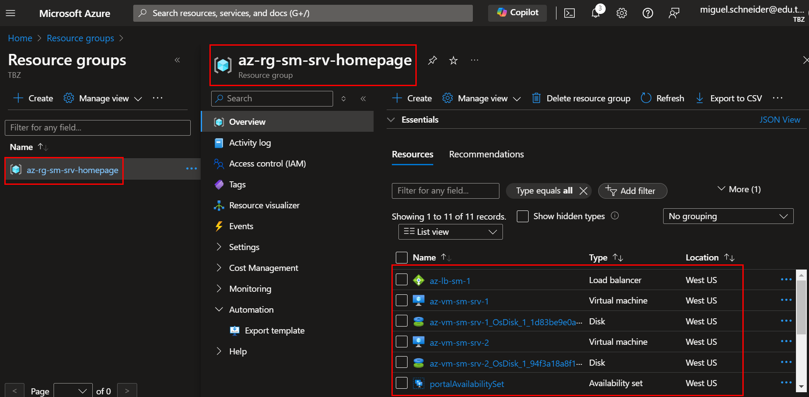

# Serverablösung

Bei der Serverablösung geht es darum, dass wir die on-premise Server in die Cloud migrieren können. 
Bevor eine Migration überhaupt durchgeführt werden kann, muss durch den Kunden entschieden werden, was genau umgesetzt werden soll. 
Anhand der folgenden Demonstrationsbeispielen, möchte ich diverse Möglichkeiten aufzeigen. 

Wie bereits im Abschnitt Entscheidung erläutert, werden die verschiedenen Server durch Dienste und Servern im Azure ersetzt. 

## Webserver

Der Webserver, welcher unteranderem die Homepage der Schule Muster hostet, würde durch die Ressourcen Loadbalancer und VMs erstellt werden. 
Es gibt zwar mehrere Möglichkeiten um eine Website zu übernehmen (App Services, Container Apps, etc.).

Für die Demonstration, möchte ich dies im kleinen Rahmen demonstrieren, was wir im grossen dann umsetzen würden. 

Damit die Homepage agil und jeder Zeit erreichbar bleibt, erstellen wir min. zwei VMs, welche mit einem Loadbalancer und Autoscaler zusammen arbeiten. 
Den Loadbalancer ist für den Lastenausgleich zuständig. 
Er verteilt die Benutzeranfragen an die verschiedenen Servern. 

Mit dem Autoscaler verhindern wir, dass die Auslastung der Homepage bei vielen Anfragen nicht überschritten wird. 
Bei einem Bestimmten Wert, beispielsweise CPU > 90% Auslastung, würde eine weitere VM erstellt werden, welche Identisch ist wie die andere und dem Frontendpool hinzugefügt werden. 
So hat der Loadbalancer neu eine neue VM, auf welcher er weitere Anfragen gleichmässig verteilen kann. 

Sobald die Last dann wieder abnimmt, beispielsweise in der Nacht, würde anhand einer Prüfung des Autoscalers wieder auf das Minimum, zurückgestellt werden. 

Mit dieser Technik können wir die Kosten auf dem Minimum halten, denn wir erhalten nur das in Rechnung gestellt über, was wir defektiv brauchen. 

Im Backend, würden dann DBs mit den gebrauchten Daten stehen, welche wir Zonen-Redundant aufbauen würden. 
Bei diesem bespiel wurden jedoch die DBs durch eine VM abgebildet. Dies würde jedoch dann durch SQL DBs betrieben werden. 

### Demo

Eine Demo, welche zum jetzigen Zeitpunkt ausgeführt werden kann, gibt es nicht. 
Ich möchte dies jedoch in der Dokumentation mit Screenshots aufzeigen. 
Am Tag der Präsentation würde dann eine Demo stattfinden.

Um die Demoumgebung aufzubauen, kann das Script [setup_enviroment_loadbalancer_and_homepage.sh](./Scripts_for_Demos/setup_enviroment_loadbalancer_and_homepage.sh) verwendet werden. 
Wichtig zu beachten ist, dass die Setup-Dateien, in einem Repo stehen, welches nur mit einem Access-Token von mir herunter geladen werden können. 

In dieser Demo zeige ich auf, wie wir den Loadbalancer eingerichtet haben und wie das mit einer Homepage ablaufen würde.

Beim erstellen der Ressource, beachten wir zusätzlich das [Namenskonzept](../03_Entscheidung/Nameconcept.md), welches wir im vorhinein definiert haben. 


*Ressourcen in Ressourcengruppe markiert*

Wie wir hier sehen können haben wir in der Ressourcengruppe einen Loadbalancer, zwei VMs, deren SSDs, etc. 

Die Konfiguration des Loadbalancers sieht folgendermassen aus:

```JSON
{
    "name": "az-lb-sm-1",
    "id": "/subscriptions/2b300788-6f75-4d7e-ad1a-cf02b57283ea/resourceGroups/az-rg-sm-srv-homepage/providers/Microsoft.Network/loadBalancers/az-lb-sm-1",
    "etag": "W/\"71cd2464-9538-48f0-93af-36f5676be51b\"",
    "type": "Microsoft.Network/loadBalancers",
    "location": "westus",
    "properties": {
        "provisioningState": "Succeeded",
        "resourceGuid": "b81cf145-0406-464c-b02f-d560b8da6fe1",
        "frontendIPConfigurations": [
            {
                "name": "SMFrontEnd",
                "id": "/subscriptions/2b300788-6f75-4d7e-ad1a-cf02b57283ea/resourceGroups/az-rg-sm-srv-homepage/providers/Microsoft.Network/loadBalancers/az-lb-sm-1/frontendIPConfigurations/SMFrontEnd",
                "etag": "W/\"71cd2464-9538-48f0-93af-36f5676be51b\"",
                "type": "Microsoft.Network/loadBalancers/frontendIPConfigurations",
                "properties": {
                    "provisioningState": "Succeeded",
                    "privateIPAllocationMethod": "Dynamic",
                    "publicIPAddress": {
                        "id": "/subscriptions/2b300788-6f75-4d7e-ad1a-cf02b57283ea/resourceGroups/az-rg-sm-srv-homepage/providers/Microsoft.Network/publicIPAddresses/SMPublicIP"
                    },
                    "loadBalancingRules": [
                        {
                            "id": "/subscriptions/2b300788-6f75-4d7e-ad1a-cf02b57283ea/resourceGroups/az-rg-sm-srv-homepage/providers/Microsoft.Network/loadBalancers/az-lb-sm-1/loadBalancingRules/SMLoadBalancerRule"
                        }
                    ]
                }
            }
        ],
        "backendAddressPools": [
            {
                "name": "SMBackEndPool",
                "id": "/subscriptions/2b300788-6f75-4d7e-ad1a-cf02b57283ea/resourceGroups/az-rg-sm-srv-homepage/providers/Microsoft.Network/loadBalancers/az-lb-sm-1/backendAddressPools/SMBackEndPool",
                "etag": "W/\"71cd2464-9538-48f0-93af-36f5676be51b\"",
                "properties": {
                    "provisioningState": "Succeeded",
                    "loadBalancerBackendAddresses": [
                        {
                            "name": "az-rg-sm-srv-homepage_webNic2ipconfig1",
                            "id": "/subscriptions/2b300788-6f75-4d7e-ad1a-cf02b57283ea/resourceGroups/az-rg-sm-srv-homepage/providers/Microsoft.Network/loadBalancers/az-lb-sm-1/backendAddressPools/SMBackEndPool/loadBalancerBackendAddresses/az-rg-sm-srv-homepage_webNic2ipconfig1",
                            "etag": "W/\"71cd2464-9538-48f0-93af-36f5676be51b\"",
                            "properties": {
                                "provisioningState": "Succeeded",
                                "networkInterfaceIPConfiguration": {
                                    "id": "/subscriptions/2b300788-6f75-4d7e-ad1a-cf02b57283ea/resourceGroups/az-rg-sm-srv-homepage/providers/Microsoft.Network/networkInterfaces/webNic2/ipConfigurations/ipconfig1"
                                }
                            },
                            "type": "Microsoft.Network/loadBalancers/backendAddressPools/loadBalancerBackendAddresses"
                        },
                        {
                            "name": "az-rg-sm-srv-homepage_webNic1ipconfig1",
                            "id": "/subscriptions/2b300788-6f75-4d7e-ad1a-cf02b57283ea/resourceGroups/az-rg-sm-srv-homepage/providers/Microsoft.Network/loadBalancers/az-lb-sm-1/backendAddressPools/SMBackEndPool/loadBalancerBackendAddresses/az-rg-sm-srv-homepage_webNic1ipconfig1",
                            "etag": "W/\"71cd2464-9538-48f0-93af-36f5676be51b\"",
                            "properties": {
                                "provisioningState": "Succeeded",
                                "networkInterfaceIPConfiguration": {
                                    "id": "/subscriptions/2b300788-6f75-4d7e-ad1a-cf02b57283ea/resourceGroups/az-rg-sm-srv-homepage/providers/Microsoft.Network/networkInterfaces/webNic1/ipConfigurations/ipconfig1"
                                }
                            },
                            "type": "Microsoft.Network/loadBalancers/backendAddressPools/loadBalancerBackendAddresses"
                        }
                    ],
                    "backendIPConfigurations": [
                        {
                            "id": "/subscriptions/2b300788-6f75-4d7e-ad1a-cf02b57283ea/resourceGroups/az-rg-sm-srv-homepage/providers/Microsoft.Network/networkInterfaces/webNic2/ipConfigurations/ipconfig1"
                        },
                        {
                            "id": "/subscriptions/2b300788-6f75-4d7e-ad1a-cf02b57283ea/resourceGroups/az-rg-sm-srv-homepage/providers/Microsoft.Network/networkInterfaces/webNic1/ipConfigurations/ipconfig1"
                        }
                    ],
                    "loadBalancingRules": [
                        {
                            "id": "/subscriptions/2b300788-6f75-4d7e-ad1a-cf02b57283ea/resourceGroups/az-rg-sm-srv-homepage/providers/Microsoft.Network/loadBalancers/az-lb-sm-1/loadBalancingRules/SMLoadBalancerRule"
                        }
                    ]
                },
                "type": "Microsoft.Network/loadBalancers/backendAddressPools"
            }
        ],
        "loadBalancingRules": [
            {
                "name": "SMLoadBalancerRule",
                "id": "/subscriptions/2b300788-6f75-4d7e-ad1a-cf02b57283ea/resourceGroups/az-rg-sm-srv-homepage/providers/Microsoft.Network/loadBalancers/az-lb-sm-1/loadBalancingRules/SMLoadBalancerRule",
                "etag": "W/\"71cd2464-9538-48f0-93af-36f5676be51b\"",
                "type": "Microsoft.Network/loadBalancers/loadBalancingRules",
                "properties": {
                    "provisioningState": "Succeeded",
                    "frontendIPConfiguration": {
                        "id": "/subscriptions/2b300788-6f75-4d7e-ad1a-cf02b57283ea/resourceGroups/az-rg-sm-srv-homepage/providers/Microsoft.Network/loadBalancers/az-lb-sm-1/frontendIPConfigurations/SMFrontEnd"
                    },
                    "frontendPort": 80,
                    "backendPort": 80,
                    "enableFloatingIP": false,
                    "idleTimeoutInMinutes": 4,
                    "protocol": "Tcp",
                    "enableDestinationServiceEndpoint": false,
                    "enableTcpReset": false,
                    "allowBackendPortConflict": false,
                    "loadDistribution": "Default",
                    "disableOutboundSnat": false,
                    "backendAddressPool": {
                        "id": "/subscriptions/2b300788-6f75-4d7e-ad1a-cf02b57283ea/resourceGroups/az-rg-sm-srv-homepage/providers/Microsoft.Network/loadBalancers/az-lb-sm-1/backendAddressPools/SMBackEndPool"
                    },
                    "backendAddressPools": [
                        {
                            "id": "/subscriptions/2b300788-6f75-4d7e-ad1a-cf02b57283ea/resourceGroups/az-rg-sm-srv-homepage/providers/Microsoft.Network/loadBalancers/az-lb-sm-1/backendAddressPools/SMBackEndPool"
                        }
                    ],
                    "probe": {
                        "id": "/subscriptions/2b300788-6f75-4d7e-ad1a-cf02b57283ea/resourceGroups/az-rg-sm-srv-homepage/providers/Microsoft.Network/loadBalancers/az-lb-sm-1/probes/SMHealthProbe"
                    }
                }
            }
        ],
        "probes": [
            {
                "name": "SMHealthProbe",
                "id": "/subscriptions/2b300788-6f75-4d7e-ad1a-cf02b57283ea/resourceGroups/az-rg-sm-srv-homepage/providers/Microsoft.Network/loadBalancers/az-lb-sm-1/probes/SMHealthProbe",
                "etag": "W/\"71cd2464-9538-48f0-93af-36f5676be51b\"",
                "properties": {
                    "provisioningState": "Succeeded",
                    "protocol": "Http",
                    "port": 80,
                    "requestPath": "/",
                    "intervalInSeconds": 5,
                    "numberOfProbes": 2,
                    "loadBalancingRules": [
                        {
                            "id": "/subscriptions/2b300788-6f75-4d7e-ad1a-cf02b57283ea/resourceGroups/az-rg-sm-srv-homepage/providers/Microsoft.Network/loadBalancers/az-lb-sm-1/loadBalancingRules/SMLoadBalancerRule"
                        }
                    ]
                },
                "type": "Microsoft.Network/loadBalancers/probes"
            }
        ],
        "inboundNatRules": [],
        "outboundRules": [],
        "inboundNatPools": []
    },
    "sku": {
        "name": "Standard",
        "tier": "Regional"
    }
}
```


