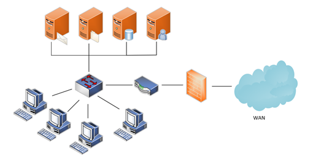

# Praxisarbeit Schule Muster

- [Praxisarbeit Schule Muster](#praxisarbeit-schule-muster)
  - [1. Informationen](#1-informationen)
    - [1.1 Ausgangslage](#11-ausgangslage)
    - [1.2 Ziele](#12-ziele)
    - [1.3 Abgrenzung](#13-abgrenzung)
  - [2. Planung](#2-planung)
    - [2.1 Zeitplanung](#21-zeitplanung)
    - [2.2 Seusag](#22-seusag)
  - [3. Entscheidung (Evaluationen)](#3-entscheidung-evaluationen)
    - [3.1 Evaluation für Desktopablösung](#31-evaluation-für-desktopablösung)
  - [4. Mögliche Realisierung](#4-mögliche-realisierung)
    - [4.1 Demonstration (Anwendungseinleitung)](#41-demonstration-anwendungseinleitung)
  - [5. Weitere Schritte](#5-weitere-schritte)
  - [6. Fazit](#6-fazit)
    - [6.1 Empfehlung Schule Muster](#61-empfehlung-schule-muster)
    - [6.2 Alternativen](#62-alternativen)
  - [7. Reflektion](#7-reflektion)

## 1. Informationen

### 1.1 Ausgangslage
Wie bereits auf der Hauptseite erwähnt, haben wir folgende Ausgangslage:

Die Schule Muster aus dem Simmental in Bern hat aktuell eine veraltete On-Premises Umgebung, 
welche erneuert werden soll. 
Dem Schulleiter wurde von mehreren Schulen, die ISE AG in Einsiedeln empfohlen, da die ISE AG 
bereits viele solche Projekte begleiten und durchführen konnte. 
Die ISE AG ist auch bereits in den Schulumgebungen Tätig und übernimmt dort den 2nd und 3rd Level 
Support. 
Da die Server veraltet sind und kaum noch Updates erhalten, wurde der Wunsch geäussert, dass der 
Schritt Richtung Cloud eingeleitet werden soll.
Da die aktuelle Umgebung (gemäss logischem Schema) bereits auf Microsoft-Technologien basieren, 
ist der Wunsch, dass alles auch mit Microsoft umgesetzt wird.

An der Schule Muster sind es rund 250 Schülerinnen und Schüler (SuS), 30 Lehrpersonen (LP) und 
rund 30 Mitarbeitende (MA: Schulverwaltung, Schulleitung, Hausdienst, etc.)
Die LPs und MAs arbeiten zurzeit mit Desktops und Networkshares, welche über den File-Server 
verwaltet werden. Die SuS können aktuell nur via PC-Zimmer mit Desktops arbeiten, was in Zukunft
durch Notebooks abgelöst werden soll. Jeder SuS hat dann ein eigenes Notebook.

### 1.2 Ziele

Ziel dieser Aufgabe ist es, die Umgebung von der Schule Muster in die Cloud zu planen.
Es wird keine Migration durchgeführt, wesentlich nur die Planung davon. 
Damit die Schule Muster weiss, was es für Möglichkeiten gibt, so wird eine Auflistung aller Arbeiten gemacht, inkl. einzelner Services, welche Demonstriert werden.
Anhand der vorgeschlagenen Umsetzungsmöglichkeiten kann im Anschluss die Schule Muster 
entscheiden, was sie umgesetzt haben möchten.   
Folgende Ziele werden für die Arbeit definiert: 
- Umsetzungsvorschläge für die Schule Muster, gemäss dem logischen Schema.
- Umsetzungsvorschlag für Identity Management
-  Evaluation und Umsetzungsvorschlag für Ablösung der Desktop PCs
-  Umsetzungsvorschlag für die Datenspeicherung und Sicherung
- Demonstrationen einzelner Services in Sandboxen, gemäss den Vorschlägen für die Schule Muster erstellen und Dokumentieren.
- Kostenzusammenstellung für die Schule Muster, für die erarbeiteten Umsetzungsvorschläge, erstellen.

### 1.3 Abgrenzung

Die Schule Muster, ist eine fiktive Schule, welche für diese Aufgabe / Projekt erfunden worden ist. 
Das Netzwerk, welches oben definiert ist, wurde auch extra für diese Aufgabe zusammengestellt und ist 
nicht bei jemandem so vorzufinden. 
Das anhand dieser Aufgabe / Projekts, definierte Ziel ist so zu verstehen, dass der Student sich in 
erster Linie mit den Azure Services, im Rahmen der AZ-104 Zertifizierung informiert und dokumentiert. 
Anschliessend an dieser Informationsbeschaffung, macht er einen oder mehrere Vorschläge für die 
Umsetzung des Projektes.
In diesen Vorschlägen werden anhand von Demonstrationen einzelne Services vorgezeigt, damit der 
Kunde einen Einblick in die Services hat.
Zum Schluss werden diese Vorschläge so aufgestellt, dass der Kunde eine Übersicht der Kosten hat,
und eine Empfehlung wird seitens des Studenten abgegeben.
Die Migration, respektive eine Umsetzung würde durch den jeweiligen Spezialisten erfolgen, auf welche 
nicht gross eingegangen wird in der Dokumentation. (Abgrenzung gemäss Seusag)
Folgende Services und Bereiche werden nicht über dieses Projekt genau definiert oder nur in der 
Auflistung der Kosten oder der Empfehlung erwähnt:
- Hardware (Notebooks für SuS)
- Intune
- Netzwerkaufbau (Router, Firewall, APs, WLAN, IPs, LAN, etc)

## 2. Planung

### 2.1 Zeitplanung

Ein Zeitplan für dieses Projekt, im Rahmen der Semesterarbeit ist so, zur Zeit nicht möglich, da keine Realisierungsstrategie definiert wurde und nicht Klar ist, was im Endeffekt realisiert wird. 
Eine genauere Zeitplanung eines Projekts ist erst möglich, sobald die Schule Muster endgültig definiert, was sie genau umgesetzt haben möchten.

Die Zeitplanung in diesem Abschnitt ist eine ungefähre Kalkulation, welche für eine mögliche Realisierung verwendet werden kann. 

### 2.2 Seusag

## 3. Entscheidung (Evaluationen)

### 3.1 Evaluation für Desktopablösung

Unter der Entscheidung, respektive Evaluation, wird eine geeignete Lösung für die Ablösung der Desktop Clients evaluiert und in einen Vorschlag empfohlen.

Für die Evaluation stehen 3 Virtualisierungsberflächen, welche alle als PaaS agieren. 
- Citrix
- VMWare
- Azure Virtual Desktops

## 4. Mögliche Realisierung

### 4.1 Demonstration (Anwendungseinleitung)

Anhand der Evaluierung und des Vorschlages für die Schule Muster, werden in diesem Abschnitt einige Services Demonstriert. 
Der jeweilige Dienst wird unter den Links genauer erklärt und Demonstriert. 

- Identity Management

## 5. Weitere Schritte 

## 6. Fazit

### 6.1 Empfehlung Schule Muster

### 6.2 Alternativen

## 7. Reflektion

 
 

> [⌂ **Zurück zur Hauptseite**](https://github.com/Radball-Migi/HF-ITCNE24-SemArbeit1-AZ104-Azure-Administrator-Associate)