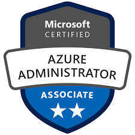

# Semesterarbeit 1 

# Cloudeinstieg der Schule Muster inkl.   Zertifizierung AZ-104, Microsoft Certified: Azure Administrator Associate

## 1. Azure Theorie

### [Azure Theorie](./Azure_Theorie/) 

> [!WARNING]  
> Aufgrund des Rückstandes des Projekts, wurde die Priorisierung angepasst und somit wird die Dokumentierung der Theorie zu einem späteren Zeitpunkt fertiggestellt. 
> Weitere Infos können Sie unter [Entscheidung Priorisierung](./Zwischenbesprechungen/Zwischenbesprechung2.md) einsehen.

## [2. Praxis (Teilprojekt Schule Muster)](./Praxis_Schule-Muster/)

## 3. Zwischenbesprechungen

Die Zwischenbesprechungen dienen dazu, dass ich in erster Linie meinen Fortschritt der Lehrperson / des Experten vorzuzeigen und den aktuellen Stand der Semesterarbeit zu besprechen. 
Durch die Zwischengespräche kann ich bereits eine erste Reflektion erstellen und daraus gewisse Massnahmen ziehen. 

Unter den nachfolgenden Links, sind die einzelnen "Protokolle" zur jeweiligen Besprechung:

- [1. Zwischengespräch (hat nicht Stattgefunden)](./Zwischenbesprechungen/Zwischenbesprechung1.md)
- [2. Zwischengespräch (14.06.2024 oder 24.06.2024)](./Zwischenbesprechungen/Zwischenbesprechung2.md)
- [3. Zwischengespräch (hat nicht Stattgefunden)](./Zwischenbesprechungen/Zwischenbesprechung3.md)

## [4. Zertifizierung](./Zertifizierung/README.md)
## [5. Reflexion & Schlusswort](./Reflektion/README.md) 

##### Quellen

**Microsoft Learn**

https://learn.microsoft.com/en-us/training/courses/az-104t00 

**Copilot, ChatGPT, AI**

[Copilot (microsoft.com)](https://copilot.microsoft.com/)
[ChatGPT](https://chatgpt.com/)

 
